# 1. Uvod:

Nalazimo se u vremenu velike količine podataka, sve te podatke čoveku je protrebno mnogo vremena da obradi, a sam proces pronalaženja nekog paterna, ili mesta za poboljšanje je težak posao koji zahteva velike količine analize...
Danas imamo razne sisteme koji te podatke, uz smernice, brže obrade i sami nađu rešenja koja mogu biti pritom mnogo kvalitetnija od onih nađenih od strane čoveka.\
Sama naziv ovog predmeta "Računarska inteligencija", kao i oblast kojima pripadaju sistemi koje obrađujemo na ovom predmetu "Veštačka inteligencija", pominju **inteligenciju** u svojim nazivima što stvara pogrešnu ideju.\
Mada se kaže veštačka inteligencija, inteligencija nije stvarno ono što je u pozadini ovih sistema... naravno zavisi kako se na inteligenciju gleda, ali ono što najbolje predstavlja **inteligenciju**, kakvu mi ljudi posedujemo, jeste sposobnost da iz starog znanja gradimo novo znanje u vidu ideja, umetnosti i sl... Iz ove ideje je i sama oblast nastala, "posmatramo ljude kao mašine" i pokušamo da to rekreiramo. Postoje sistemi koji automacki dokazuju teoreme i rešavaju ih nalik čoveku, problem nastaje kod skalabilnosti zadataka, zbog čega se praktikuje drugačiji pristup.\
Sami principi rada, mnogih algoritama koje obrađujemo, zasnovani su na **prirodnim pojavama**, kao što je kretanje mrava (ACO), organizovanost pčela (ABC), interakcija čestica (PSO) ili sama evolucija inspirišu ove algoritme. Sam princip rada ovih algoritama (**metaheuristika**) svodi se na istraživanju prostora rešenja, odnosno pronalaženju što optimalnijeg rešenja, koristeći heuristike kao "smernice".\
Mašinsko učenje, inspirisano radom neurona, svodi se na izgradnju modela, koji su velike kompleksne funkcije koje posmatrajući podatke podešavaju težine parametara i konstante unutar svakog nerurona, ovi modeli se kasnije koriste za rešavanje problema nalik onim nad kojima su učeni. Za razliku od algoritama koji koriste logiku, heuristiku, kao glavni način pronalaženja rešenja, sistemi kao što je mašinsko učenje koriste se statistikom koju su stekli posmatranjem velikog broja podataka.\
Za rad ovakvih sistema potrebna je dobra analiza podataka, zatim određuejmo kakav je problem, njegovu kompleksnost, način kako ćemo rešiti probleme i naravno koje alate koristimo. Nijedan probelm nije rešiv na jedan način i jednim algoritmom, svaki probelm možemo rešiti na više načina jedino je bitno naći onaj pristup koji najviše odgovara probelmu i koji daje najbolje rezultate.

### Analitika:

Analitika podataka predstavlja **istraživanje**, **interpretaciju** i **komunikaciju** izmežu podataka u cilju pronalaženja šablona u podacima. (prilikom istraživanja koristimo se statistikom)
Ono što analitika obuhvata jeste istraživanje starih podataka radi pronalaženja ***trendova***, kako bi se videla reakcija na odluke ili dešavanja. 
Želimo da popravimo rezultate tako što učimo nad starim događajima.

Analitika se deli na:
- **Deskriptivnu** - sumira statistike, vizualizuje ih i klasteruje podatke u cilju primećivanja njihove povezanosti. Opisuje glaven osobine podataka.
- **Prediktivna** - koristeći podatke iz prošlosti  grade se modeli koji mogu da predvide rezultate. Koristi se Linearna regresija, ML modeli, Logistićkaregresija, CART... Direktno se nadovezuje na deskriptivnu analitiku, predviđa buduća ponašanja.
- **Preskriptivni** - daje predlog kako dobiti najbolje rezultate. Direktno se nadovezuje na prediktivnu analitiku, određuje šta treba da se desi i šta treba uraditi kako bi se to ispunilo. Simulacije, nelinearno, linearno i celobrojno programiranje...

### Odlučivanje:

Cilj odljučivanja je dolazak do nekog rezulatat.
Odlučivanje se deli na:
- **Nestruktuirani problemi** - problemi koji su novi ili neobični, informacije su nepodpune.
- **Neprogramirane odluke** - unikatne i koje se ne ponavljaju često.
- **Struktuirani problemi** - cilj je jasan, poznat (problem je nastajao predhodno), potpuno su definisani.
- **Programirane odluke** - odluka koja nastaje često i za koju postoje rutinski pristupi.

Odluke se prave kada je ispunjeno neko od sledeća dva uslova:
- **Sigurnost** - situacija u kojoj znamo sve moguće posledice, možemo napraviti tačne odluke.
- **Nesigurnost (Rizik)** - situacija u kojoj ne možemo garantovati posledice, možemo samo definisati verovatnoću posledice.

**Model odluka** - mora imati osobinu da predviđa posledice određene odluke.
### Optimizacija:

Maksimizovanje ili minimizovanje neke funkcije relatino sa nekim drugim rešenjima, uz dodatna ograničenja. 
Dodatno pričamo o ovome u 4. poglavlju.
### Napredni alati:
Podela:
 1. **Deskriptivni alati:**\
	Fokusiraju se na analizu onoga što se već dogodilo ili šta se trenutno dešava. Izveštavaju i daju uvid u prošle i trenutne performanse sistema ili poslovanja. Primeri uključuju analize prodaje u prethodnim kvartalima, podatke o prometu na web stranicama, ili izveštaje o korisničkom zadovoljstvu.
 2. **Prediktivni alati:**\
	Koriste statističke tehnike i algoritme mašinskog učenja za predviđanje budućih događaja ili ponašanja na osnovu istorijskih podataka. Na primer, predviđanje potražnje za proizvodima, prognoze vremenskih uslova, ili predviđanje kvarova na mašinama.
 3. **Preskriptivni alati:**\
	Ovi alati idu korak dalje od predikcije jer ne samo da govore šta će se dogoditi, već i sugerišu šta treba preduzeti kako bi se postigli željeni rezultati. Oni koriste optimizacione algoritme i simulacije kako bi preporučili najbolje akcije ili odluke, npr. optimizacija zaliha u trgovini ili kreiranje efikasnih ruta za dostavu.

**Prediktivna analitika** je ključna primena mašinskog učenja, jer se koristi za analizu i predviđanje budućih trendova. Ovo uključuje rad sa ogromnim količinama podataka, obično u realnom vremenu, gde se model trenira na istorijskim podacima kako bi prepoznao obrasce i pravio predviđanja.\
Kako podaci postaju zastareli, zrelost modela opada što znači da modeli postaju manje tačni i efikasni vremenom.

# 2. Paradigme u veštačkoj inteligenciji:

Paradigme, u veštačkoj inteligencijij, možemo podeliti na one koje se koriste različitim heuristikama u cilju pronalaženja rezultata i one paradigme koje se koriste statistikama.\
Oblast veštačke inteligencije je počela kao nauka zasnovana na algoritmima, koji oponašaju neke pojave u svetu oko nas. Pa tako svako otkriće u oblasti je bilo pronalaženje nove heuristike, algoritma koji bi proširio načine rešavanja problema.\
Danas kada se kaže veštačka inteligencija uglavnom se misli na **velike jezičke modele** (**LLM** - Large Language Models), najpoznatiji je ChatGPT (OpenAI), po pisanju ove skripte veliku popularnost stiče i DeepSeek zbog ubedljivo manje uloženih novčanih sredstava za izgradnju samog modela, kao i činjenica da je open-source.\
Ovakvi modeli rade po principu statistika, odnosno posmatrajući velike količine odabranih podataka grade svoje "znanje", što im omogućava razumevanje teksta kao i generisanje samog teksta. Kompanija OpenAI je izbacila i AI model Sora koji je trenutno predvodeći u generisanju videa.\
Ovakvi modeli, mada funkcionišu, ne doprinose preterano razvoju ove oblasti, za razliku od prethodno aktuelnih paradigmi koje su radile po principu algoritama, svakim nastankom novog LLM modela, ne nastaje nikakvo novo otkriće, pošto njihov kvalitet zavisi isključivo od količine i kvaliteta podataka koje su dostupne modelu prilikom njegovog razvića.  

| ChatGPT                           | DeepSeek                           |
| --------------------------------- | ---------------------------------- |
|  |  |

Na ovom predmetu bavimo se i paradigmama koje su zasnovane na logici, posmatranju sveta oko nas kao i onim paradigama koje su zasnovane na statistici i podacima.

 Osnovne paradigme: 
1. Veštačke neuronske mreže (ANN)  
2. Evolutivna izračunavanja (EC) 
3. Inteligencija grupa (SI)
4. Veštački imuni sistem (AIS)
5. Rasplinuti sistemi (Fuzzy systems)

O svim paradigmama biće dodatno rečeno. Svaka od paradigmi ima svoje podparadigme zasnovane/inspirisane istim principima.

## 2.1 Veštačke neuronske mreže (ANN):

Ove mreže oponašaju način na koji ljudski mozak obrađuje informacije, koristeći veštačke neurone koji obrađuju informacije kroz slojeve. Svaki neuron prima ulazne podatke (npr. informacije iz okruženja ili drugih neurona), množi ih odgovarajućim težinama (w1, w2, w3…) i primenjuje aktivacionu funkciju kako bi odlučio da li će poslati signal i sa kojom snagom. ANN se široko koriste u oblastima kao što su prepoznavanje zvuka (npr. u glasovnim asistentima), prepoznavanje oblika (npr. u računalnoj viziji), i kontrola robota.
Spada u paradigme statistike i podataka.

Ovi koncepti i alati su ključni za razumevanje savremenih tehnika veštačke inteligencije i mašinskog učenja, posebno u kontekstu njihovih praktičnih primena i sposobnosti.

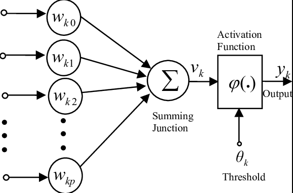

## 2.2 Evolutivna izračunavanja (EC):
Evolutivna izračunavanja su metoda optimizacije zasnovana na simulaciji prirodne selekcije, gde se jedinke koje su bolje prilagođene okruženju "preživljavaju" i prenose svoje "gene" (karakteristike) na sledeće generacije. Oni koji se lošije prilagode ne prenose svoje gene, što omogućava da populacija u celini postane bolja vremenom. Rekombinacija gena preživelih jedinki stvara nova rešenja, simulirajući prirodni evolucioni proces. Na ovaj način, evolutivni algoritmi "uče" kroz generacije kako da dođu do optimalnog rešenja za zadati problem.

Ključni koncepti:
- **Populacija:** Skup potencijalnih rešenja (jedinki) u algoritmu.
- **Fitnes funkcija:** Funkcija koja ocenjuje koliko je svaka jedinka uspešna u rešavanju problema.
- **Selektivni pritisak:** Jedinke sa boljim karakteristikama imaju veću šansu da prenesu svoje gene na sledeće generacije.

### 2.2.1 Genetski algoritmi (GA):
Genetski algoritmi su najpoznatija forma evolutivnih izračunavanja i funkcionišu tako što predstavljaju rešenja problema kao nizove binarnih vrednosti (0 i 1), poznate kao "hromozomi". Svaki hromozom predstavlja jedan mogući način rešavanja problema. Algoritam zatim koristi operacije kao što su **rekombinacija (ukrštanje)** i **mutacija** kako bi stvorio nove jedinke (nove nizove 0 i 1) u svakoj generaciji. Ove nove jedinke se zatim testiraju pomoću fitnes funkcije, a one koje daju bolje rezultate imaju veće šanse da budu zadržane i dalje evoluiraju.

Ključne operacije u GA:
- **Ukrštanje (Crossover):** Dva roditeljska rešenja se kombinuju da bi se kreirala nova rešenja.
- **Mutacija:** Nasumična promena vrednosti unutar rešenja, koja obezbeđuje raznolikost i izbegava lokalne minimume.

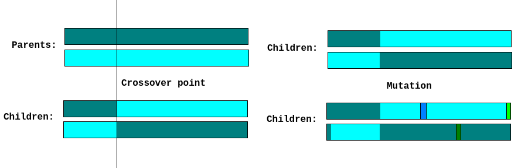

### 2.2.2 Genetsko programiranje (GP):
Genetsko programiranje je posebna vrsta evolutivnog algoritma koja ne evoluira nizove brojeva ili binarne kodove kao u genetskim algoritmima, već evoluira **programe**. Svaka jedinka je računski program koji se optimizuje kroz generacije. Cilj je stvoriti program koji na najbolji način rešava zadati problem. Kroz generacije, GP koristi rekombinaciju, mutacije i selekciju kako bi kreirao sve efikasnije programe.

Glavne karakteristike GP:
- Evoluira se **struktura programa**.
- Može se koristiti za automatizovano generisanje koda, kreiranje strategija ili predikcionih modela.
- Primene uključuju dizajn algoritama, modeliranje i predikciju, kao i automatizaciju zadataka.

### 2.2.3 Evolutivno programiranje (EP):
Evolutivno programiranje se razlikuje od genetskih algoritama po tome što se ne fokusira na rekombinaciju gena, već se promene vrše na individualnim jedinkama kroz stohastičke mutacije. U EP, populacija je skup rešenja koja se optimizuju kroz promenu pojedinih karakteristika (članova niza) rešenja. Cilj EP je pronaći optimalno rešenje kroz iterativno prilagođavanje rešenja bez direktne rekombinacije.

Ključne karakteristike EP:
- Promene su stohastičke i odnose se na pojedinačne elemente niza.
- Fokus je na mutaciji i evoluciji kroz generacije.
- Koristi se u rešavanju problema optimizacije i modeliranja složenih sistema.

### 2.2.4 Koevolucija:
Koevolucija opisuje proces u kojem različite populacije evoluiraju u međusobnoj interakciji. Ovo znači da evolucija jedne populacije zavisi od evolucije druge. Primer su predatori i plen u prirodi: kako plen postaje brži i spretniji, tako predatori moraju evoluirati da bi ih i dalje hvatali. U kontekstu algoritama, to može uključivati "parazite" ili ometajuće faktore koji usporavaju ili komplikuju evolucioni proces, čineći zadatak težim za optimizaciju.

Ključne karakteristike koevolucije:
- Evolucija se dešava u međusobno zavisnim populacijama.
- "Paraziti" mogu ometati ili izazivati osnovnu populaciju da se prilagođava.
- Koristi se u problemima gde postoji višestruka interakcija između različitih elemenata, kao što su igre sa više igrača, tržišne simulacije, ili optimizacija mreža.

Evolutivna izračunavanja se najčešće koriste kada:
1. **Ne postoji deterministički algoritam** koji može u prihvatljivom vremenu dati rešenje za problem. Na primer, složeni problemi optimizacije ili NP-teški problemi ne mogu se efikasno rešiti determinističkim algoritmima.
2. **Klasifikacija podataka** je potrebna, mada mašinsko učenje često nudi bolja rešenja za ove zadatke. Ipak, evolutivni algoritmi mogu biti korisni kada je problem specifičan ili ne može lako da se modelira korišćenjem tradicionalnih tehnika mašinskog učenja. 

Evolutivni algoritmi pružaju fleksibilnost i mogu istraživati veliki prostor rešenja, često pronalazeći neintuitivna, ali efikasna rešenja za složene probleme.

## 2.3 Inteligencija grupa (Swarm Intelligence - SI):

Odnosi se na sposobnost grupa organizama, poput ptica, mrava ili pčela, da pokažu složeno ponašanje kroz jednostavne individualne interakcije. Ovi organizmi funkcionišu prema pravilima kolektivnog ponašanja, gde svaka jedinka donosi jednostavne odluke, ali zajedno postižu inteligentne rezultate bez centralizovane kontrole. U domenu veštačke inteligencije, SI se koristi za optimizaciju i rešavanje složenih problema, imitirajući ovu vrstu grupne koordinacije.

### 2.3.1 PSO (Particle Swarm Optimization):
PSO je metoda optimizacije koja se zasniva na kolektivnom ponašanju jata ptica. U ovom algoritmu, ptice (ili čestice) se kreću kroz višedimenzioni prostor podataka, tražeći optimalno rešenje problema. Svaka čestica u PSO algoritmu prilagođava svoju poziciju na osnovu sopstvenog iskustva i iskustva drugih čestica iz jata. Kako se ptice kreću kroz prostor, privlače jedna drugu ka boljim rešenjima, pa su veće šanse da će se kretati ka optimalnom rešenju. Na sličan način funkcionišu i algoritmi zasnovani na ponašanju mrava (ACO - Ant Colony Optimization), gde mravi tragaju za optimalnim rešenjem problema zasnovanim na lokalnim interakcijama i ponašanju grupe.

## 2.4 Rasplinuti (fuzzy) sistemi:

Ovo su sistemi koji mogu raditi sa nejasnim, nepotpunim ili dvosmislenim informacijama. 
Umesto da koriste striktna pravila kao klasični sistemi, rasplinuti sistemi omogućavaju "sive zone", gde se odluke donose na osnovu verovatnoće ili približnih vrednosti.
Logika nije strogo binarna (0 ili 1), već vrednosti mogu biti između 0.0 i 1.0. U ovim sistemima, odluke se donose na osnovu stepena pripadnosti određenim skupovima, što omogućava fino podešavanje odluka i ponašanja u situacijama koje nisu strogo definisane. 

| S                               | Trapez                               | Trougao                                |
| ------------------------------- | ------------------------------------ | -------------------------------------- |
| 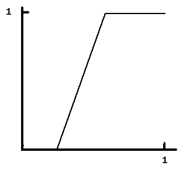 | 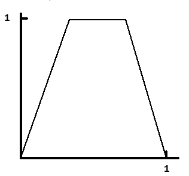 | 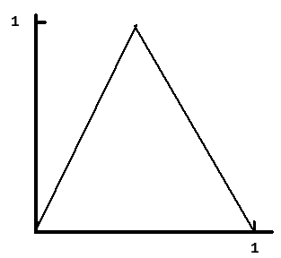 |

Fazi logika dozvoljava rad sa nepreciznim, nejasnim ili nepotpunim informacijama, simulirajući ljudsko rasuđivanje u takvim uslovima. Koriste se u oblasti kontrole, kao što su pametni termostati ili sistemi za navigaciju.

# 3. Veliki jezički modeli (LLM):

Složeni algoritmi zasnovani na ANN, kao što su chat roboti, koji su trenirani na velikim količinama podataka kako bi mogli da razumeju i odgovaraju na pitanja u prirodnom jeziku. Ovi modeli koriste prethodno analizirane i ispitane podatke, i primenjuju se u specifičnim, užim domenima, ali su dovoljno fleksibilni da odgovaraju na različite upite u okviru svog znanja. Velika baza podataka omogućava im da analiziraju i razumeju pitanja, a zatim generišu odgovore koristeći tehnike generisanja prirodnog jezika (NLG - Natural Language Generation).

Način rada LLM-a:
1. **Analiza podataka pomoću dubokog učenja:** Ovaj proces uključuje obradu i razumevanje velikih količina podataka kako bi LLM model mogao da nauči zakonitosti ljudskog jezika.
2. **Generisanje odgovora na osnovu podataka (NLG):** Nakon što LLM razume pitanje, koristi svoju bazu znanja da generiše koherentan i relevantan odgovor.

Proces pravljenja LLM-a:
1. **Priprema:** U ovoj fazi vrši se tokenizacija (razbijanje teksta na manje delove ili tokene), uzorkovanje podataka i umetanje tokena koji su relevantni za dalje učenje modela.
2. **Mehanizam pažnje (attention mechanism):** Fokusira se na specifične delove ulaznih podataka kako bi generisao specifične delove izlaznih odgovora, omogućavajući modelu da efikasnije procesira relevantne informacije. Dve popularne kategorije su **instruction** i **classification** fine-tuning.
    - **Instruction fine-tuning** : podaci sadrže instrukcije i već predodređena rešenja.
    - **Classification fine-tuning** : podaci su označeni sa klasom koju treba da asociraju (npr. mejlovi koji su asocirani sa "spam" i "not spam") 
3. **Arhitektura LLM-a:** Sve informacije se kombinuju u koherentnu strukturu koja omogućava modelu da obavlja zadatke učenja i generisanja odgovora.
4. **Prethodno treniranje i treniranje:** Model se inicijalno trenira od nule koristeći velike skupove podataka, gde uči osnovne jezičke strukture i zakonitosti.
5. **Fino obučavanje:** Nakon inicijalnog treniranja, model se dodatno usavršava na specifičnim skupovima podataka, kako bi bio prilagođen za određene domene i zadatke (na primer, pravni savetnici, medicinski asistenti).

## 3.1 Transformer arhitektura:

Većina LLM-ova se oslanja na transformer arhitekturu, NNA predstavljen 2017, prvo korišćen za mehanizam prevođenja engleskog teksta u tekst na nemačkom ili francuskom.\
Sastavljen iz dva modula:
	- **enkoder**: procesuira uneti tekst i predstavlja ga u vidi vektora sa numeričkim vrednostima koji predstavlja kontekst teksta.
	- **dekoder**: vektor enkodera se daje dekoderu koji dekodira dobijeni vektor i gradi rečenicu u izabranom jeziku.

Izgrađeni na ovom konceptu su:

**BERT** (bidirectional encoder representations from transformer) - pronalazi sakrivene/maskirane reči u tekstu. (korišćen je na Twitteru za pronalaženje neprikladnih postova)\
**GPT** (generative pretrained transformers) - generiše tekst (prevođenje, pisanje koda, dovršavanje rečenica...), trenirani da predpostave sledeću reč na osnovu već ispisanih reči...

LLM i transformer se danas tretiraju kao sinonimi usled velike zasnovanosti LLM-a na arhitekturi transformera.

## 3.2 Ograničenja LLM-a:

1. **Razumevanje konteksta:** Iako LLM-ovi mogu obrađivati veliki broj informacija, često imaju poteškoće sa dubljim razumevanjem konteksta ili složenih apstraktnih veza.
2. **Pristrasnost:** LLM modeli su često pristrasni jer se oslanjaju na podatke na kojima su trenirani. Ako ti podaci sadrže pristrasnost, i sam model će ih reflektovati.
3. **Zdrav razum:** Iako mogu simulirati razumevanje jezika, LLM-ovi nemaju zdrav razum kakav ljudi poseduju, što znači da mogu generisati odgovore koji su logički tačni, ali nemaju smisla u realnim situacijama.
4. **Etika: (iz predhodne tri tačke)** Odluke i odgovori koje generišu LLM modeli zavise od podataka na kojima su obučeni, što može voditi do etičkih dilema, kao što su širenje netačnih informacija ili diskriminatornih stavova.

# 4. Optimizacioni algoritmi:

Veštačka inteligencija se najviše koristi kao alat za pronalaženje rešenja onih probleme koji imaju velike prostore pretrage, odnosno problemi koji poseduju veliki broj rešenja.\
Kada kažemo da želimoda optimizujemo problem, mislimo na pronaženje njegovog minimuma odnosno maksimumu, tražimo najbolje rešenje našeg probelma.\
Pa možemo reći da je optimizacioni algoritam specifična vrsta algoritama koji pripadaju grupi pretrage, a njihov glavni cilj je da pronađu optimalno rešenje za datu ciljnu funkciju, koja može biti minimizacija ili maksimizacija, uz određeni skup ograničenja.

## 4.1 Uvod u optimizacione algoritme:

Prilikom definisanja bilo kog problema, potrebno je definisati **prostor rešenja** (feasible region), odnosno moramo definisati koja rešenja su dozvoljena koristeći **skup ograničenja**, definišemo zavisnosti između nezavisnih promenljivih.\

Ograničenja u optimizaciji mogu se primenjivati na sledeće načine:
1. **Odbacivanje:** Nedozvoljena rešenja se jednostavno odbacuju.
2. **Dodeljivanje penala:** Nedozvoljenim rešenjima se dodeljuju kazneni bodovi, što ih čini manje atraktivnim tokom pretrage.
3. **Smanjivanje na bez ograničenja:** Rešenja se prvo optimizuju bez ograničenja, a zatim se dodaju ograničenja kako bi se izabrala dopustiva rešenja.
4. **Održavanje dopustivosti:** Tokom pretrage, održava se dopustivost rešenja tako što se stalno proveravaju ograničenja.
5. **Uređivanje dopustivih rešenja:** Metode se koriste za generisanje i održavanje skupa dopustivih rešenja.
6. **Popravljanje:** Ako se naiđe na nedozvoljeno rešenje, mogu se primeniti metode za njegovo ispravljenje kako bi postalo dozvoljeno.

Prostor rešenja u kojem se vrši optimizacija može se podeliti na:
- **Kombinatornu optimizaciju:** Ova vrsta optimizacije se bavi problemima gde je prostor rešenja diskretan, a jedan od najpoznatijih primera je **problem trgovackog putnika (TSP - Traveling Salesman Problem)**.
- **Globalnu optimizaciju:** Ova metoda se bavi problemima u kojima su rešenja kontinualna i gde se traži najbolja moguća vrednost funkcije cilja u celokupnom prostoru rešenja.

Ove klasifikacije i principi igraju ključnu ulogu u razvoju i primeni optimizacionih algoritama u različitim oblastima, uključujući inženjering, ekonomiju, operativna istraživanja i mnoge druge.

Definisanje problema i prostor rešenja je pola posla, sledeći deo jeste osmisliti funkciju kojom možemo da računamo kvalitet pronađenog rešenja.\
Ovakva funkcija se naziva i **funkcija cilja** ili **fitness funkcija**, ona mapira prostor rešenja $\!S$ u realne brojeve $\!R$. Pa funkciju možemo definisati kao $f: \!S \rightarrow \!R$, onda ako je $x \epsilon \!R$ što je vrednost fitness funkcije manja, to je rešenje optimalnije. Minimum i maksimum ovakve funkcije može da se svede na isto, pošto važi da je maksimum od **f** isto sto i minimum od **-f**.
Fitness funkcija nam pomaže kao alata za poređenje rešenja, kako bi se konstantno kretali kao nama optimalnom rešenju.\
Ovde i stupa na snagu algoritam deo **optimizacionih algoritama**, svi algoritmi se razlikuju po principu nalaženja sledećeg rešenja ali rade po identičnom principu:
- **while** nije ispunjen određeni cilj ili kriterijum:
	- **Izračunaj vrednost:** Prvo se izračunava vrednost funkcije cilja za trenutno rešenje.
	- **Izračunaj pravac i smer pretrage:** Na osnovu trenutne vrednosti, određuje se pravac u kojem će se nastaviti pretraga.
	- **Izračunaj dužinu koraka pretrage:** Definiše se koliko daleko se ide u odabranom pravcu.
	- **Pređi u naredno rešenje:** Na osnovu prethodnih koraka, prelazi se na sledeće rešenje u pretrazi.
- **end**

Sama fitness funkcija ne mora da bude jedna, već može da bude skup funkcija, kriterijuma. Ovakva optimizacija naziva se i **višeciljna optimizacija**. Uglvanom u složenijim situacijama kao što je ekonomija i transportni problemi, odnosno problemi u kojima se razmatraju različiti faktori, poput troškova, vremena, kapaciteta i kvaliteta usluge.\
Postoje dva glavna pristupa u rešavanju višeciljnih optimizacija:
1. **Pravljenje ponderisanih proseka (agregacija):** Ovaj pristup uključuje kombinovanje više ciljeva u jednu jedinstvenu funkciju cilja putem ponderisanja, što omogućava da se različiti kriterijumi tretiraju kao jedinstveni problem. Na taj način, svaki kriterijum se množi sa svojim težinskim faktorom, a zatim se sumiraju.
2. **Pravljenje skupa Pareto-optimalnih rešenja:** Ovaj pristup identifikuje rešenja koja su optimalna u smislu Pareto efikasnosti, što znači da nijedno rešenje ne može biti poboljšano u jednom kriterijumu bez pogoršanja u drugom. Pareto-optimalna rešenja omogućavaju odlučivačima da biraju između različitih opcija u skladu sa svojim preferencama.

Ovi pristupi su ključni za uspešno rešavanje složenih problema u optimizaciji, omogućavajući analizu i donošenje odluka u situacijama gde su zahtevi višestruki i često suprotstavljeni.

Optimizacioni algoritmi nam omogućavaju da nađemo što bolja rešenja postavljenih problema, međutim neće uvek vratiti najbolje rešenje **globalni minimum**, odnosno **globalni maksimum**. Najrealnije je očekivati od ovakvih algoritama da nam vrate vrednosti kao što su **lokalni minimum**, odnosno **lokalni maksimum**.\
U mnogim slučajevima, algoritmi optimizacije mogu naići na lokalne minimume koji nisu globalni, što može otežati postizanje optimalnog rešenja.\
Zbog ove osobine nastaje i dodatna podela po tome da li če algoritam pretrage, naći **egzaktno** ili **približno** rešenje:
- **Egzaktno rešavanje:** Ovim pristupom se dolazi do garantovano optimalnog rešenja za problem. Koriste se algoritmi koji pružaju tačan odgovor, ali to može biti vremenski zahtevno za velike probleme.
- **Približno rešavanje:** Približni algoritmi, često bazirani na (meta)heuristikama, pružaju rešenja koja nisu nužno optimalna, ali su dovoljno dobra u praksi. Ovi pristupi su korisni kada je problem previše složen za egzaktno rešavanje u razumnom vremenu (NP ili eksponencijalne slozenosti).

### Metaheuristike:
Predstavljaju skup opštih metoda koje pružaju okvir za rešavanje optimizacionih problema, često na osnovu stohastičnih, odnosno nasumičnih, procesa. One su korisne kada nemamo precizne informacije o optimalnom rešenju. Uglavnom se baziraju na „slabim“ pretpostavkama ili čak na odsustvu pretpostavki o problemu, čineći ih fleksibilnim za različite primene.

### Optimizacione metode:
Optimizacione metode imaju za cilj da pronađu optimum u prostoru dozvoljenih rešenja. Rešenja su dozvoljena ako su zadovoljena postavljena ograničenja.\
**Klasifikacija metoda:**
1. **Pretraga:** Metode se mogu deliti na **lokalne** i **globalne** metode pretrage. Lokalne metode traže rešenja u blizini trenutnog rešenja, dok globalne metode pretražuju širi prostor rešenja kako bi pronašle najbolja moguća rešenja.
2. **Pristup pretrage:** Postoje **stohastičke** metode (poput Monte Karlo) koje koriste nasumične uzorke da bi istražile prostor rešenja, i **determinističke** metode koje koriste unapred definisane strategije i pravila. 
	Cesto se koriste kombinacije stohastičkog i determinističkog pristupa.

Naravno ne susrećemo se uvek sa novim instancama probelma, ponekad problemi liče na one koje smo prethodno videli, u tim situacijama vršimo **redukciju probelma**.\
**Redukcija** se koristi za prevođenje problema na poznati oblik radi lakšeg rešavanja. Na primer, imamo problem $A_1$ za koji postoji poznat algoritam, dok problem $A_2$ predstavlja novi problem koji treba rešiti. Ako možemo prevesti problem $A_2$ u problem $A_1$ (koji već znamo da rešavamo), tada se problem $A_2$ može rešavati algoritmom za $A_1$.

## 4.2 Korist optimizacionih algoritama:

Kada dođe do problema visoke vremenske složenosti, želimo da se koristimo optimizacionim algoritmima. Deja je da ako pokušavamo da prođemo sva moguća rešenja u prostoru rešenja, neki problemi bi se rešavali stotinama godina pa i više.
Vremenska složenost algoritma opisuje kako se vreme izvršavanja algoritma menja sa veličinom ulaznih podataka. **O notacija** koristi se za izražavanje gornje granice složenosti algoritma i omogućava klasifikaciju algoritama prema njihovoj efikasnosti.
Na osnovu vremenske složenosti, problemi koji su nejproblematičniji su:
- **Eksponencijalni problemi:**\
	Vreme izvršavanja raste eksponencijalno sa veličinom ulaznih podataka. Primer eksponencijalnog problema je „pronalazak svih razapinjajućih stabala u potpunom grafu sa n čvorova“ ili „traženje najboljeg poteza u igri šaha“. Eksponencijalni problemi su računski vrlo zahtevni i obično nisu rešivi u razumnom vremenu za velike ulaze.
- **Faktorijalni problemi:**\
	Vreme izvršavanja raste faktorijalno sa veličinom ulaza.

Kako optimizacioni agoritmi zaobilaze pristup gde se svaka kombinacija rešenja proverava, većina ovih algoritama uvodi neku količinu stohastičnosti u rešavanje problema, dok se pritom i fokusiraju na trenutno rešenje u cilju njegovog "popravljanja". Pojavljuju se dva bitna pristupa u pronalaženju rešenja:
- **Intenzifikacija (exploitation)** – fokusiramo se na pretragu u blizini trenutnog dobrog rešenja, oslanjajući se na postojeća dobra rešenja kako bismo dobili stabilne rezultate.
- **Diverzifikacija (exploration)** – povremeno skrećemo sa utvrđenog puta kako bismo istražili nova rešenja i eventualno otkrili bolje mogućnosti, postižmo izabiranjem lošijeg rešenja.

U pristup intenzifikacije se ubraja **lokalna optimizacija**. **Lokalna optimizacija** se fokusira na pronalaženje najboljeg rešenja u neposrednom okruženju trenutnog rešenja, često nazivano **lokalni minimum**.\
Nedostatak ovog pristupa je to što, čak i ako dođemo do lokalnog minimuma, možda ćemo propustiti bolje, globalno rešenje.\
Načina za proširenje pretrage koristeći se diverzifikacijom:
- **Povećanje koraka pretrage** – iako može pomoći u pronalaženju boljih rešenja, ne garantuje pronalazak globalnog minimuma.
- **Nasumično ispitivanje tačaka** – nasumičnim pokušajima, tokom dugog trajanja pretrage, povećava se verovatnoća da ćemo pronaći globalni minimum.

### Penjanje uzbrdo:
**Penjanje uzbrdo** (eng. Hill Climbing) je tehnika koja se zasniva na **gradijentnom kretanju**. 
Postupak je sledeći:
1. Počnemo sa nekom vrednošću (rešenjem).
2. Odredimo kvalitet tog rešenja pomoću fitnes funkcije.
3. Blago promenimo početno rešenje, prelazeći u novu iteraciju, i uporedimo rezultate. Ako je novo rešenje bolje, usvajamo ga kao polaznu tačku za sledeću iteraciju.

### Single-State globalna optimizacija:
Uključuje niz koraka za pronalaženje najboljeg mogućeg rešenja iz globalne perspektive, tj. uzimajući u obzir ceo prostor mogućih rešenja.
1. **Selection (Izbor)** – biranje trenutnog rešenja kao početne tačke.
2. **Jump to Something New (Prelazak na novo)** – prelazak u različite oblasti prostora rešenja, omogućavajući izbegavanje lokalnih minimuma.
3. **Use a Large Sample (Korišćenje velikog uzorka)** – istraživanje većeg broja mogućih rešenja kako bi se povećala šansa za pronalaženje globalnog optimuma.
### Nedeterministički polinomski problemi (NP):
**NP problemi** su problemi za koje je moguće proveriti rešenje u polinomijalnom vremenu, ali nije jasno da li ih možemo i rešiti u polinomijalnom vremenu za svaki slučaj. Za takve probleme nije poznato da li se mogu tačno rešiti u polinomijalnom vremenu.
### NP-potpunost:
**NP-potpuni problemi** su specifični NP problemi za koje važi da, ako možemo napraviti algoritam koji ih rešava u polinomijalnom vremenu (P složenosti), svi NP problemi mogu se rešiti u polinomijalnom vremenu (ovo najverovatnije nije moguce, neki smatraju da su klase P i NP odvojene klase). NP-potpuni problemi su istovremeno najteži problemi u NP klasi i sinonim za NP-teške probleme.

# 5. Grafovi

**Graf** je matematička struktura koja se koristi za modeliranje odnosa između objekata.

Sastoji se od osnovnih komponenti:
1. **Čvorovi (vertices)** – predstavljaju entitete u grafu (gradovi).
2. **Grane (edges)** – povezuju čvorove, označavajući odnos između njih (putevi izmedju gradova).

**Put** – niz grana koji povezuje jedan čvor sa drugim.\
**Ciklus** – put koji počinje i završava u istom čvoru, čineći zatvorenu petlju.\
**Brojčani stepen čvora** – broj grana koje izlaze iz određenog čvora.\
**Izolovani čvor** – čvor koji nije povezan sa nijednim drugim čvorom.\
**Susedi** – čvorovi koji su direktno povezani sa nekim čvorom putem grana.\
**Ekscentričnost čvora** - meri najveću udaljenost (broj grana) do bilo kojeg drugog čvora u grafu. Ovo može biti korisno u analizi mreža kako bi se identifikovali najudaljeniji čvorovi od određenih polaznih tačaka.\
**Komponente povezanosti** - su podgrafovi unutar grafa gde su svi čvorovi međusobno povezani, dok su čvorovi iz različitih komponenti odvojeni jedni od drugih jednom granom. Ovo je ključno u analizi mreža, jer ukazuje na različite grupe unutar strukture grafa.

Grafovi su primenljivi u različitim oblastima, kao što su **lingvistika** (analiza strukture rečenica), **informatika**, **biologija** (analiza odnosa u genomima), i **društvene mreže** (modeliranje povezanosti korisnika).

## 5.1 Multigraf:
**Multigraf** je tip grafa koji sadrži **paralelne grane**, odnosno više grana između istih parova čvorova. Koristi se kada su moguće različite veze između istih entiteta (npr. različiti putevi između dva grada)

## 5.2 Težinski i netežinski grafovi:
1. **Težinski grafovi** – svaka grana ima pridruženu vrednost ili težinu. (može predstavljati udaljenost, trošak, vreme, itd.)
2. **Netežinski grafovi** – grane nemaju težinu. Važno je samo da povezuju čvorove, ne koliko su te veze „teške“ ili „skupe“.

## 5.3 Usmereni grafovi:
**Usmereni grafovi** su grafovi u kojima svaka grana ima definisan pravac, tj. vodi od jednog čvora ka drugom, poput jednosmernih ulica u saobraćajnim mrežama. U usmerenim grafovima mogu postojati grane koje su dvosmerne.

## 5.4 Drvo:
**Drvo** je specijalna vrsta grafa koja ima sve čvorove povezane tako da ne sadrži cikluse. Sastoji se od čvorova i grana i karakteriše se time što postoji tačno jedan put između svakih parova čvorova. Drveće se često koristi u informatici za organizaciju podataka (npr. u pretraživačkim algoritmima) jer omogućava strukturu sa efikasnim pretragama i manipulacijama podacima.

# 6. Linearno programiranje (LP):

**Linearno programiranje (LP)** predstavlja optimizaciju linearne funkcije sa ograničenjima koja su izražena kao nejednakosti. Na primer, farmer ima ograničene resurse za sadnju povrća, linearno programiranje može mu pomoći da maksimizira profit unutar tih ograničenja.

## 6.1 Pogodan region (Feasible Region):
Pogodan region predstavlja prostor rešenja dobijen presecima ograničenja, koji čine prostor u kojem pretražujemo optimalna rešenja. Kod problema sa više promenljivih, ovaj prostor se nalazi u višedimenzionalnom prostoru. Minimalna ili maksimalna vrednost ciljne funkcije će se sigurno naći u nekoj od graničnih tačaka ovog regiona, kao što su teme, ivice ili stranice.

## 6.2 Geometrijski princip rešavanja:
Za pronalaženje optimalnog rešenja linearna funkcija (npr. ( ax + by = c )) se "pomeranjem" kroz pogodan region (menjanjem vrednosti konstante ( c )) postavlja u najvišu ili najnižu tačku gde dotiče region. Kada funkcija prestane da se pomera unutar ovog prostora, dostigli smo optimalno rešenje.

| Svi uslovi                           | Dobijen pogodni region                  |
| ------------------------------------ | --------------------------------------- |
| 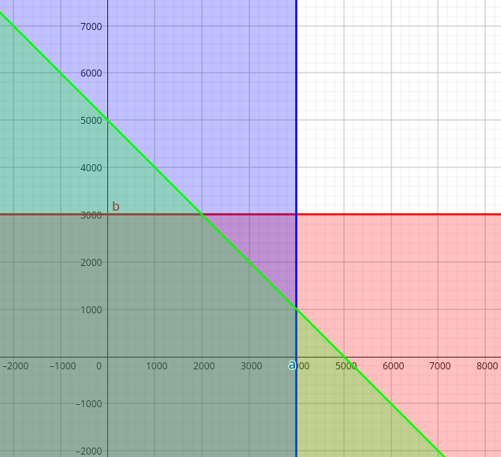 | 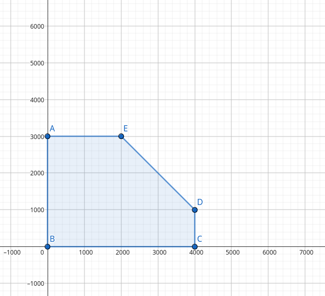 |

Plavo predstavlja ograničenje količine šargarepa, crveno ogranićenje krompira, zeleno da njihov zbir ne prelazi 5000.

Na slici vidimo da je zapravo pogodan region bas presek ove tri boje, racunajuci samo ono u pozitivnom delu.

| Min                       | Mid                       | Max                       |
| ------------------------- | ------------------------- | ------------------------- |
| 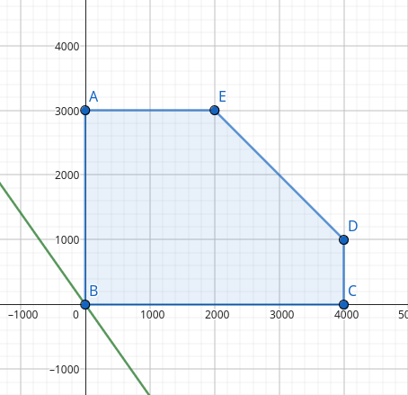 | 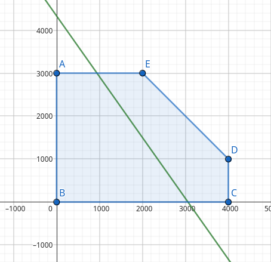 | 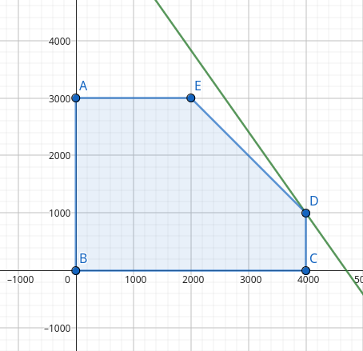 |

Pomeranjem funkcije ax + by = c, uvećavanjem konstante c nalazimo maksimum. Minimalno rešenje za c = 0, a maksimum za c = 8000.

Međutim, geometrijski pristup nije efikasan za složenije probleme, te se koristi **Simplex metod**.

## 6.3 Simplex metod:
Simplex metod optimizuje linearnu funkciju pomerajući se po ivicama pogodne oblasti, od temena do temena. Na osnovu svojstva da se optimum nalazi u temenima (ili na ivicama), Simplex postupno menja vrednosti promenljivih, identifikujući onu promenljivu koja će uvećati funkciju. Promenljive koje se menjaju nazivamo "popuštene" (loose ili non-basic), dok su one koje ostaju nepromenjene "zategnute" (tight ili basic).

#### Koraci Simplex algoritma:
1. Definišemo linearnu funkciju(promenljive se predstavljaju sa x i dodeljenim indeksom) i ograničenja. $f(x_1, x_2) = ax_1 + bx_2$
2. Svakom ograničenju dodeljujemo novu promenljivu, čime svodimo nejednakosti na jednakosti. $s_1, s_2,\ldots$
3. Na početku sve s-promenljive su popuštene (loose), i stoje same sa leve strane jednačine.
4. Algoritam:
   - Biramo promenljivu sa najvećim koeficijentom u funkciji i "popuštamo" je.
   - Biramo koju s-promenljivu ćemo "zategnuti" na osnovu razmera konstanti u ograničenjima.
   - Ubacujemo dobijenu vrednost promenljive u funkciju i ponavljamo proces dok svi koeficijenti uz promenljive ne postanu negativni.

### 6.3.1 Primer primene simplex algoritma – Farmer:
Farmer može posaditi šargarepu (4 tone) i krompir (3 tone), ima 5 tona đubriva (dakle, može posaditi maksimalno 5 tona povrća). Krompir donosi 1,2 evra po kilogramu, dok šargarepa donosi 1,7 evra. Cilj je maksimizacija profita: 
1. Definišemo funkciju: f($x_1, x_2$) = 1.7 * $x_1$ + 1.2 * $x_2$, sa ograničenjima:\
$$x_1 \leq 4000$$\
$$x_2 \leq 3000$$\
$$x_1 + x_2 \leq 5000$$
2. Tight: $x_1$, $x2$:\
$$x_1 + s_1 = 4000$$\
$$x_2 + s_2 = 3000$$\
$$x_1 + x_2 + s_3 = 5000$$
3. Loose: $s_1$, $s_2$, $s_3$:\
$$s_1 = 4000 - x_1$$\
$$s_2 = 3000 - x_2$$\
$$s_3 = 5000 - x_1 - x_2$$
4. U formuli max(1.7 * $x_1$ + 1.2 * $x_2$), najveći koeficijent ima $x_1$, pa prelazi u loose skup, posmatramo u kojim fomrulama se pojavljuje, vidimo ga u 1. i 3., upoređujemo razmere $-4000 \geq -5000$, dakle $s_1$ prelazi u tight skup. Raspoređujemo opet tight i loose elemente na predodređene strane jednačine, pa se menja samo prva jednačina $x_1 = 4000 - s_1$ i menjamo je u sve ostale:\
$$x_1 = 4000 - s_1$$\
$$s_2 = 3000 - x_2$$\
$$s_3 = 1000 + s_1 - x_2$$\
max(-1.7 * $s_1$ + 1.2 * $x_2$ + 6800)\
Kako idalje imamo pozitivne koeficijente u funkciji ponavljamo 4. korak. Sada je najveći koeficijent uz $x_2$ dakle on prelazi u skup loose, upoređujemo razmere $-3000 \leq -1000$, prebacujemo $s_3$ u tight i dobijemao $x_2 = 1000 - s_1 - s_3$, pa nju menjamo u ostale:\
$$x_1 = 4000 - s_1$$\
$$s_2 = 2000 - s_1 + s_3$$\
$$x_2 = 1000 + s_1 - s_3$$\
max(0.5 * $s_1$ - 1.2 * $s_3$ + 8000)\
Kako su obe konstante negative znamo da ako pokušamo da maksimizujemo samo ćemo naći manja rešenja. Da bi našli traženu maksimalnu vrednost dovoljno je da zamenimo $s_1$ i $s_3$ sa 0, dobijamo 8000. Ako nas zanimaju vrednosti $x_1$ i $x_2$ dovoljno je da zamenimo $s_1$ i $s_3$ sa 0 u ograničenjima koje smo dobili, $x_1 = 4000$ i $x_2 = 1000$. Što je i tačno, pogledati maksimalno rešenje geoetrijskim pristupom. 

Kod linearnih programa, poželjno je koristiti veće brojeve za izražavanje vrednosti. Na primer koristimo tone umesto kilograma, što poboljšava tačnost proračuna.

Postoji i prošireni pristup poznat kao **Integer Linear Programming (ILP)**, koji dozvoljava samo celobrojne vrednosti, što može biti korisno u praktičnim situacijama gde su delimična rešenja nemoguća.

**Dualni problem**: Od prethodno postavljenog problema pravimo novi koji nam daje gornje ograničenje rešenja (koliko maksimalno para možemo da dobijemo a da su uslovi ispunjeni), rešenje dualnog problema će dati isto rešenje kao prvo postavljen problem.

Za gore navedena ograničenja tražimo takvo $y_1$, $y_2$ i $y_3$ da kada pomnože redom ograničenja dobijemo vrednosti koje u zbiru nam govore da tražena maksimalna vrednost ne može biti veca od dobijene. Moraju biti nenegativni, i posmatrajući ograničenja predstavljamo $x_1$ preko $y_1$ + $y_3$ $\geq$ 1.2 pošto je to baš vrednost koja stoji pored $x_1. Slično za $x_2$ pravimo novo ograničenje $y_2$ + $y_3$ $\geq$ 1.7. 
Ovo su nam nova ograničenja a funkciju više ne želimo da maksimizujemo vež minimizujemo i ona menja oblik: min(3000 * $y_1$ + 4000 * $y_2$ + 5000 * $y_3$).

# 7. Celobrojno programiranje (ILP):

Šta ako se bavimo izradom stolica i stolova, koristeći gore LP način možemo da dobijemo rešenje koje nam donosi maksimalan profit ali izradom pola stolice.... Ovo nema smisla, zbog toga postoji celebrojno programiranje (**Integer linear prograimmng**) koje ograničava da su rešenja u skupu prirodnih brojeva.

## 7.1 Pogodan region ILP (ILP Feasable region):

Rešavamo problem stolica i stolova, imamo da stolice vrede 20, stolovi 50. Izrada stolica troši 10 jedinica drveta, a stolova 15, vremenski stolice se prave 2 sata a stolovi 5 sati. Koja je maksimalna zarada ako imamo 15 sati i 60 jedinica drveta za izradu.  

Grafički prikaz bi bio sličan kao za LP, prvo predstavimo feasable region kao da su dopuštena realna rešenja, nakon čega dodajemo ograničenje celobrojnih brojeva.

| LP ograničenja                   | LP Fesable region                   | ILP Fesable region                   |
| -------------------------------- | ----------------------------------- | ------------------------------------ |
| 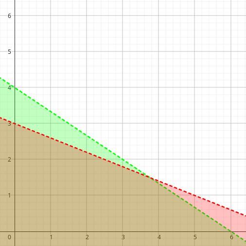 | 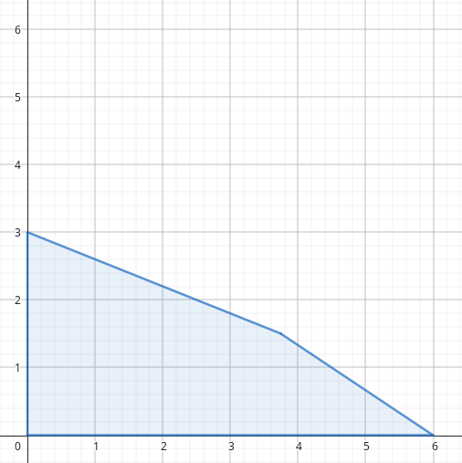 | 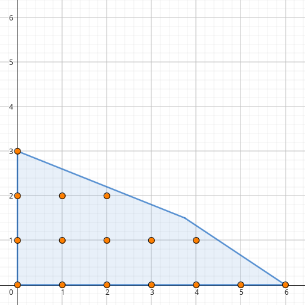 |

Tačke predstavljaju sva dopuštena rešenja.

Ukoliko rešavamo problem koji sadrži i paramtere koji moraju biti celobrojni i parametara koji smeju imati realne vrednosti ovo se idalje naziva ILP.

## 7.2 Geometrijski princip rešavanja ILP:

Predstavimo funkciju koju želimo da maksimizujemo kao f($x_1$, $x_2$) = c, gde je c konstanta, i samo prevlačimo funkciju po regionu dok ne dotaknemo poslednu pogodnu tačku.

U našem primeru ova funkcija je $20 * x_1 + 50 * x_2 = c$

| Min                       | Mid                       | Max                       |
| ------------------------- | ------------------------- | ------------------------- |
| 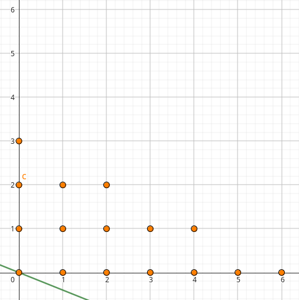 | 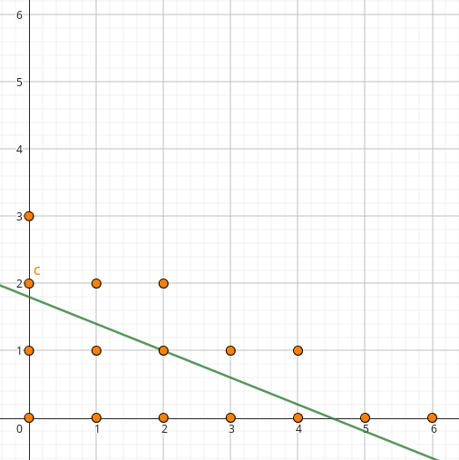 | 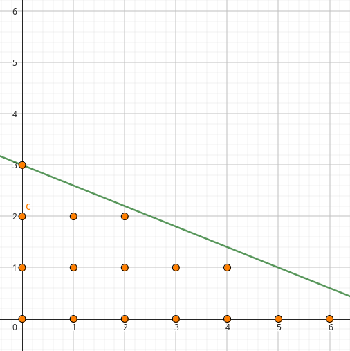 |

Maksimalnu zaradu dostižemo kada napravimo 3 stola i ni jednu stolicu, zarada je 150.

### 7.3.1 Problem ranca:
Imamo 8 različitih objekata svaki ima svoju težinu (4, 2, 8, 3, 7, 5, 9, 6) i vrednost (19, 17, 30, 13, 25, 29, 23, 10). Imamo ranac koji može da nosi maksimalno 17kg. Naš zadatak je da nađemo maksimalnu  zaradu, ali da ne pređemo ograničenje težine koju ranac može da nosi.

Za ovaj problem možemo da koristimo binarne promenljive (jesmo li uzeli ili ne objekat).
Postavka zadatka je sledeća:
1. Ograničavamo svaku promenljivu da može biti 1 ili 0 koristeći sledeća dva ograničenja:
	$$0 \leq o_1$$ $$o_2 \leq 1$$
	Istu stvar bi uradili za svaki objekat:
	$$0 \leq o_1, o_2, o_3, o_4, o_5, o_6, o_7, o_8 \leq 1$$
2. Pišemo ostala ograničenja kao što bi inače pisali u LP:
	Ograničenje težine:
	$$4 * o_1 + 2 * o_2 + 8 * o_3 + 3 * o_4 + 7 * o_5 + 5 * o_6 + 9 * o_7 + 6 * o_8 \leq 17$$
3. I konačno funkcija koju želimo da maksimizujemo:
	max($19 * o_1 + 17 * o_2 + 30 * o_3 + 13 * o_4 + 25 * o_5 + 29 * o_6 + 23 * o_8 + 10 * o_8$)\
	Radi lepšeg ispisa možemo zameniti sve ove promenljive vektorima.

# 8. Nelinearno programiranje (NLP):

Kada se bavimo problemima koji se definiše kao nelinearne funkcije, ili ograničenja pogodnog regiona su definisana kao nelinearne funkcije, tada se bavimo **nelinearnim programiranjem**. 
Sa druge strane sam princip zadavanja probelma i njihovih ograničenja je isti kao kod LP i ILP, jer sam solver rešava ovo umesto nas.
Problem kod ovih sistema jesu lokalni optimumi, jer sam NLP solver može da se zaustavi na lokalnom optimumu. Početna pozicija utiče na rešenje.

**Kada NLP solver nadje rešenje to rešenje ne mora biti optimalno!**

Načini za rešavanje ovakvih probelma može biti analitički, koristeči se znanjem izvoda možemo pronaći minimum/maximum neke funkcije. 
Koliko god analitički način bio dobar on ne može da radi uvek, neke funkcije mogu biti mnogo kompleksnije za rešavanje. U tim situacijama koristimo se numeričkom matematikom.

## 8.1 Polovljenje intervala (Bisection Method):

Jedan od osnovnih algoritama pronalaženja nule neke funkcije jeste **Polovljenje intervala**.
Algoritam se izvodi na sledeći način:
1. Biramo dve tačke na intervalu za koje važi $f(x_{l})f(x_{r}) < 0$
2. Nula funkcije je na sredini ovog intervala odnosno $x_0 = \frac{x_l+x_r}{2}$ 
3. Posmatrajući sada intervale $[x_l, x_0]$ i $[x_0, x_r]$ koristeći formulu iz koraka 1, određujemo novi interval. 
4. Onog momenta kada je formula iz 1. = 0 zaustavljamo algoritam. Alternativa i mnogo jeftinija vremenski jeste korišćenje aproksimirane greške $|\epsilon_{a}|$. Rećićemo da prihvatamo samo grešku koja je ispod nekog procenta i radimo algoritam sve dok greška nije manja ili jednaka izabranom procentu.\
	$$|\epsilon_{a}| = |\frac{x_0^{new} - x_0^{old}}{x_0^{new}}|$$

Ideja algoritma jeste da interval u kom se nalazi nula konstantno smanjujemo, ali pritom da samu nulu ne izgubimo, odnosno ceo interval konvergira ka rešenju.
Smanjivanje intervala postižemo njegovim polovljenjem, poštovajući korak 1. postižemo da sama nula bude uvek unutar tog intervala i dobijamo sledeći niz intervala:\
$$a_0 \leq x_0 \leq b_0$$\
$$a_1 \leq x_0 \leq b_1$$\
$$a_2 \leq x_0 \leq b_2$$\
$$...$$\
$$a_n \leq x_0 \leq b_n$$
\
Iz ovog niza intervala zaključujemo sledeće:\
$$a_0 \leq a_1 \leq a_2 \leq ... \leq a_n \leq x_0 \leq b_n \leq ... \leq b_2 \leq b_1 \leq b_0$$

 imamo dva opadajuća niza sa obe strane $x_0$ ($x_0$ je prava nula funkcije), samim tim konvergiraju ka $x_0$ pa možemo da zaključimo da važi $\lim_{n \to \infty}{b_n} = x_0$, isto važi za $a_n$. 

Odavde možemo izvesti još jednu formulu, pomoću koje računamo potreban broj iteracija da bi greška rešenja bila manja od nekog zadatog $\epsilon$. 
Ono što znamo iz formule za odabir sledećeg intervala jeste da je svaki novi niz pola dužine starog intervala. Iz ovog zapažanja možemo da zaključimo sledeće (sa $x^{\ast}$ označavamo približnu vrednost nule):\
$$|x^{\ast} - x_0| \leq \frac{1}{2}|b_n - a_n|$$
\
$$\frac{1}{2}|b_n - a_n| = \frac{1}{2^{n+1}}|b_0 - a_0|$$
\
Želimo da ograničimo da razlika ova $x_0$ i $x^{\ast}$ bude manje od nekog $\epsilon$:\
$$|x^{\ast} - x_0| \leq \frac{1}{2^{n+1}}|b_0 - a_0| < \epsilon$$
\
$$b_0 - a_0 < 2^{n+1}\epsilon$$
\
$$\frac{b_0 - a_0}{\epsilon} < 2^{n+1}$$
\
$$\ln{\frac{b_0 - a_0}{\epsilon}} < (n+1)\ln{2}$$
\
$$\frac{\ln{\frac{b_0 - a_0}{\epsilon}}}{\ln{2}} - 1 < n$$
\
Koristeći se konačnom formulom možemo unapred znati koliko nam je potrebno iteracija da bi dobili rezultat koji je tačnosti $|x^{\ast} - x_0| < \epsilon$.

**Primer:** Želimo da nađemo nulu funkcije $f(x) = x^2 - 2$, poprilično je jasno da je nula $x_0 = \sqrt{2}$.
U prvoj iteraciji ovog algoritma postavljamo da su mu granice $[1, 2]$. 

| f-ja                              | iter = 1                   |
| --------------------------------- | -------------------------- |
| 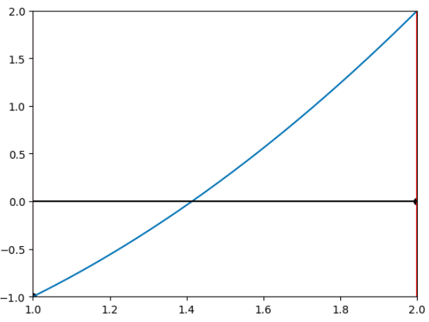 | 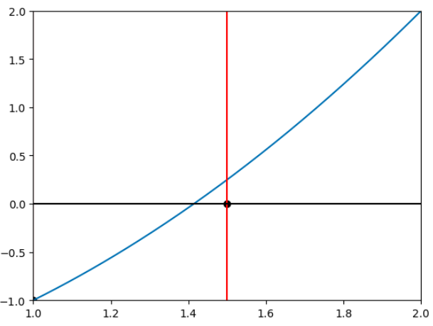 |

U prvoj iteraciji smo prepolobili interval i odabrali novu tačku kao nulu funkcije, međutim kao što se vidi na slici ta nula idalje nije dovoljno blizu, odnosno greška je prevelika.

| iter = 2                   | iter = 3                   | iter = 4                   |
| -------------------------- | -------------------------- | -------------------------- |
| 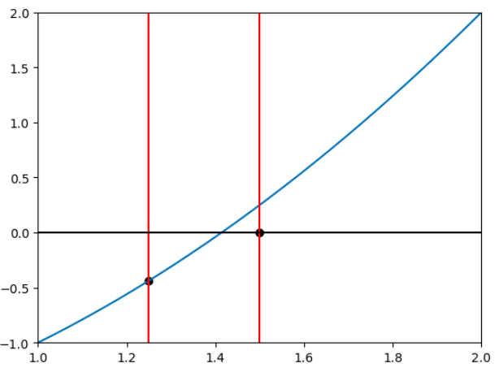 |  | 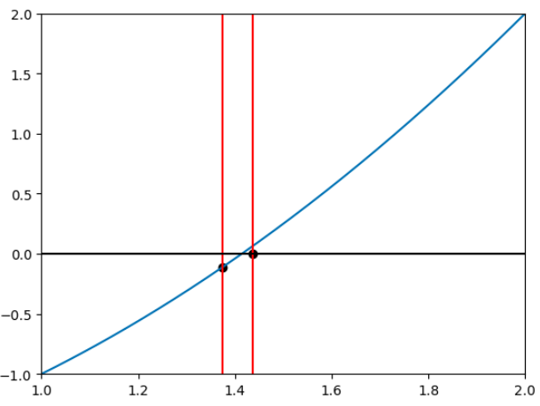 |

Ono što se primećuje sa ovih slika jeste da rešenje relativno brzo konvergira ka rešenju. Ova brzina se odrzava na početu međutim vrlo brzo se usporava:

| iter = 7                   | iter = 8                   | final                          |
| -------------------------- | -------------------------- | ------------------------------ |
|  | 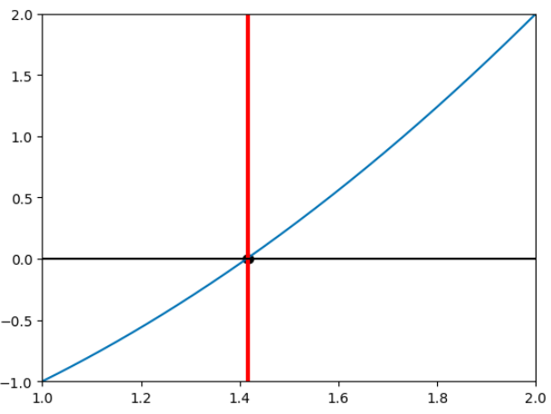 | 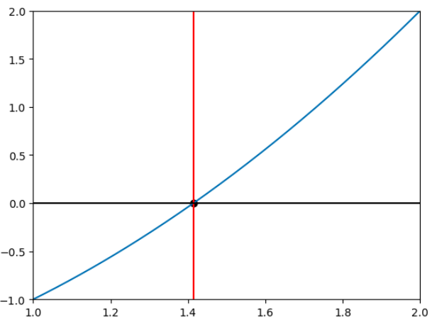 |

Po testiranju koda ovog algoritma, bilo je potrebno ukupno 36 iteracija da se postigne željena tačnost rešenja ($\epsilon = 10^{-12}$). Posmatranjem slika možemo primetiti da je razlika dužine intervala u prvih 8 iteracija mnogo značajnija od onoga postignuto nakon 8 iteracija.

Zaključak je da je mana algoritma njegova brzina, što smo bliži nuli funkcije rešenje sporije konvergira. 

## 8.2 Njutnov metod:

Kod **njutnove metode** slično kao u prethodnoj bitno nam je da znamo početne tačke i da ispunjavaju isti prvi uslov.
Algoritam se izvršava na sledeći način:
1. Pre svega funkcija mora biti diferencijabilna
2. $f(x_l)f(x_r) < 0$
3. Na izabranom intervalu funkcija mora biti konstantno rastuća ili opadajuća
	$sgn(f{'}) = const$ 
	$sgn(f^{"}) = const$ 
4. Mora da važi:\
	$$f(x_0)f^{"}(x_0) > 0$$
	
5. Svaku sledeću nulu računamo na osnovu formule:\ 
	$$x_{n + 1} = x_{n} - \frac{f(x_n)}{f^{'}(x_n)}$$
\
Formulu koju smo dobili za računanje sledeće tačke je dobijena Tejlorovim razvojem, ali moguće je do iste formule doći geometrijskim putem.\
$$f(x_n + (x^{\ast} - x_n)) = f(x_n) + \frac{f^{'}(x_n)}{1!}(x^{\ast} - x_n) + o(1)$$
\
Kako važi $f(x_n + (x^{\ast} - x_n)) = f(x^{\ast}) = 0$, dobijamo:\
$$0 = f(x_n) + f^{'}(x_n)(x^{\ast} - x_n)$$\
$$f(x_n) = -f^{'}(x_n)(x^{\ast} - x_n)$$
\
$$-\frac{f(x_n)}{f^{'}(x_n)} = x^{\ast} - x_n$$
\
Konačno:\
$$x^{\ast} = x_n -\frac{f(x_n)}{f^{'}(x_n)}$$
\
Algoritam radi tako što u svakoj iteraciji gradi tangentu na trenutno tačku $(x_i, f(x_i))$ na krivi (linearno aproksimira funkciju u datoj tački), posmatramo ono x gde je vrednost funkcije tangente 0, čime dobijamo novo x.

**Primer:** Koristimo isti primer kao za **BM**, $f(x) = x^2 - 2$. Tražena greška biće ista kao kod **BM** primera ($\epsilon = 10^{-12}$).

U nultoj iteraciji imamo funkciju i odabrano početno $x_0$:

| f - ja                            | iter = 0                   |
| --------------------------------- | -------------------------- |
|  | 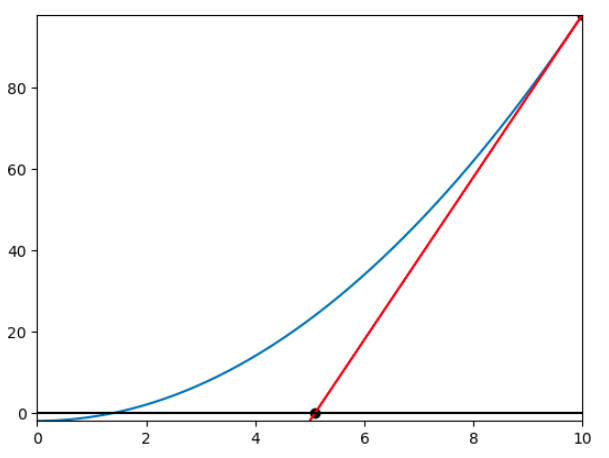 |

Koristeći se novim $x_0 = x_1$ koje smo dobili nastavljamo građenje tangenti na krivu, odnosno u tački $(x_1, f(x_1))$:

| iter = 1                   | iter = 2                   | final                          |
| -------------------------- | -------------------------- | ------------------------------ |
| 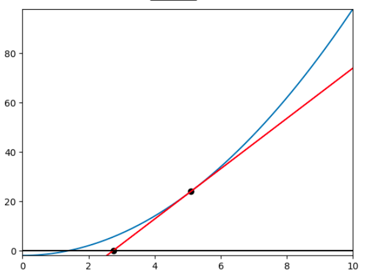 | 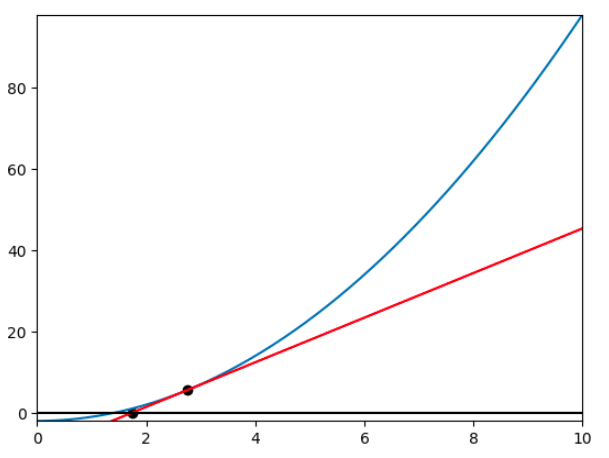 | 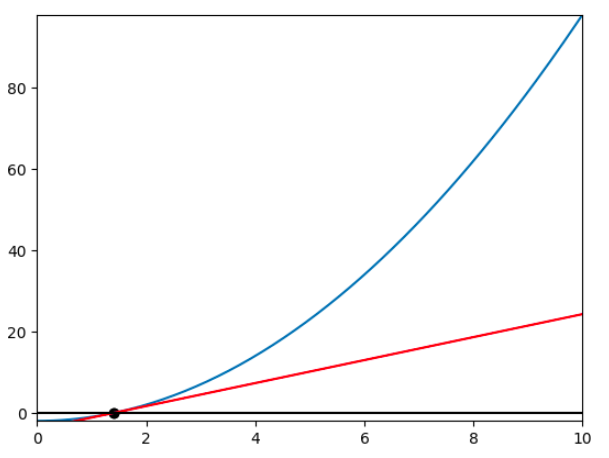 |

Po pokretanju ovog koda sa traženom greškom istom kao u primeru testiranja **BM** algoritma, rešenje je dobijeno u 7 iteracija.

Kako možemo ovaj algoritam iskoristiti za pronalaženje **minimuma funkcije**? 
Formulu koju smo koristili koristi se za pronalaženje nule funkcije, koja je gradila tangentu (koja je takođe linearna aproksimacija funckije čiju nulu tražimo) koristimo tu tangentu da vidimo kada seče x-osu i tu poziciju koristimo kao novu nulu funkcije.
Kako inače tražimo maximum ili minimum funkcije? 
Tako što uzimamo izvod te funkcije i pokušavamo da je izjednačimo sa nulom. 
Možemo da uočimo da nalik formuli koju smo koristili za nalaženje nule možemo napraviti i formulu za pronalaženje minimuma/maksimuma (ustvari gradimo kvadratnu aproksimaciju funkcije).
Formula se dobija na identičan način, razlika je što razvijamo izvod funkcije:\
$$x_{n+1} = x_n - \frac{f^{'}(x_n)}{f^{"}(x_n)}$$
\
Uzimamo one vrednosti koje su manje od prethodne najbolje vrednosti, ostatak algortima je isti kao u algortimu za pronalženje nule funkcije.

## 8.3 Gradijentni spust:
U slučaju funkcija sa više promenljivih možemo koristiti **gradijentni spust** ili malo izmenjenu njutnovu metodu koju ćemo kasnije objasniti.
Ideja prilikom istraživanja prostora jeste da nađemo njegov minimum/maksimum, odnosno da idemo u onom smeru u kom se funkcija najbrže menja.
Gradijent nam daje smer u kom funkcija najbrže raste. Odavde možemo zaključiti da ako želimo da nađemo minimum neke funkcije, dovoljno je da gledamo suprotan smer u odnosu na gradijent.

Algoritam se koristi gradijentom u svakoj iteraciji, uz dodatnu funkciju koja nam omogućava da algoritam zaustavimo.
Uslov zaustavljanja je najčešće onda kada je razlika prethodne i sadašnje vrednosti funkcije rešenja manja od neke konstante vrednosti.

### **Pseudokod Gradijentni spust:**
- generišemo rešenje $x_i$
- **while** nije ispunjen uslov:
	- descentVector = -gradientF($x_i$)
	- $x_{i+1} = x_i + alpha(x_i){*}descentVector$
	- i = i + 1
- **end**

Funkcija $alpha(x_i)$ računa $\frac{df(x_i + \alpha_i{*}descentVector)}{d\alpha_i} = 0$, minimum se traži korišćenjem nekih od tehnika koje se bave jednom promenljivom kao što je NM ili BM.

## 8.4 Njutnov metod za više promenljivih (Multiple variable NM):
Kao i u njutnovoj metodi sa jednom promenljivom, koristimo Tejlorov razvoj za $f(x_k + \Delta x)$, gde je $\Delta x = x_{k+1} - x_k$ nepoznata promenljiva, njutnov korak. 
Pitamo se u kom smeru treba da se pomerimo od tačke $x_k$ da bi našli sledeće bolje rešenje u njenoj blizini.\
$$f(x_k + \Delta x) \approx f(x_k) + \nabla f(x_k)\Delta x + \Delta xH(x_k)\Delta x$$\
> $\nabla f$ predstavlja **gradijent**
> $H$ predstavlja Hesijan matricu, kvadratna matrica parcijalnih izvoda drugog reda

Nas zanima vrednost $\Delta x$ pa tražimo optimalnu vrednost preko:\
$$\frac{\partial f(x_k + \Delta x)}{\partial \Delta x} = 0$$\
Kako su sve vrednosti konstante sem $\Delta x$ izvod je:\
$$\frac{\partial(f(x_k) + \nabla f(x_k)\Delta x + \Delta xH(x_k)\Delta x)}{\partial \Delta x} = 0$$\
$$0 + \nabla f(x_k) + H(x_k)\Delta x = 0$$\
$$H(x_k)\Delta x = -\nabla f(x_k)$$\
$$\Delta x = -H(x_k)^{-1}\nabla f(x_k)$$\
Dobili smo formulu za njutnov korak, kako je on $\Delta x = x_{k+1} - x_k$ dobijamo iterativnu formulu:\
$$x_{k+1} = x_k - H(x_k)^{-1}\nabla f(x_k)$$

Zaustavljanje slično kao u prethodnom algortimu.
## Pseudokod MVNM:
- generišemo početno rešenje x_i
- **while** nije ispunjen uslov:
	- izračunah $H(x_i)$ i $\nabla f(x_i)$
	- $x_{i+1} = x_i - H(x_i)^{-1}\nabla f(x_i)$
- **end**

Kako se ovde koristi Hesijan za kompleksnije funkcije je bolje koristiti gradijenti spust.

# 9. Metaheuristike:

**Heuristika** je metod koji "navodi" algoritam ka potencijalno dobrom rešenju, bez garancije da će pronaći optimalno rešenje. Ovi pristupi često služe za rešavanje problema gde je kompletna pretraga prostora rešenja nepraktična zbog vremenskih ili računarskih ograničenja.

**Metaheuristike** (meta - apstrakcija) su generalizovane heuristike koje se primenjuju na širi spektar problema, pružajući okvir za rešavanje sličnih problema. One koriste apstraktne principe koji mogu da se prilagode specifičnostima konkretnog problema i time "navedu" pretragu u dobrom smeru. Dakle: 
1. Nisu specifične za dati problem već skup problema
2. Podpomaže algoritmu da se ne zaglavi na lokalnim rešenjima i time efikasnije istraže prostor rešenja
3. Nisu determinističke

Primeri metaheuristika su: Genetski algoritmi (GA), Simulirano kaljenje (Simulated annealing), Optimizacija kolonije mrava (Ant colony optimization ACO), Optimizacija grupe čestica (Partical sworm optimization PSO), Variable neighborhood search (VNS) ...

Kako metaheuristike nemaju ideju o kvalitetu rešenja uglavnom se zaustavljaju na osnovu nekih spoljašnjih faktora (kao što su vreme rada algoritma ili broj iteracija). 
Kako nisu rešenja egzaktnog problema uglavnom se koriste u kombinaciji sa egzaktnim problemima.

Relativno je nova oblast koja nije bazirana ni na jednom dokazu,  teoremi.

Metaheuristike na osnovu broja rešenja dele se na:
1. **S-Metaheuristike (S - Single)** - algoritam se vrši nad jednim rešenjem koje unapređujemo vremenom. (VNS, Simulated annealing, gradijent ...)
2. **P-Metaheuristike (P - Population)** - algoritam se bavi populacijom rešenja gde svaka jedinka se kreće ka rešenju. (GA, ACO, PSO ...)

## 9.1 Trajectory methods (S - Metaheuristics):
U ovu grupu spadaju sve one metaheuristike koje se bave jednim rešenjem koje unapređuju vremenom.

Jedan od poznatih metaheuristika ovog tipa jeste VNS ili Variable neighborhood search , koji funkcioniše po sledećem principu:
1. Izabere neko pseudo nasumično rešenje
2. Odredi njegov kvalitet
3. Vršimo **Shake** operaciju koja od našeg sadašnjeg rešenja pravi nova rešenja u njegovoj okolini. 
	- prvo se predstavljaju sva rešenja dobijena izmenom jednog parametra prethodnog rešenja
	- ukoliko nije nađeno bolje rešenje povećavamo broj parametara koji smeju da se izmene i ponavljamo prethodni korak
	- ukoliko smo našli bolje rešenje, ili više nemamo parametre koje možemo da izmenimo, prekidamo postupak
4. Sada bolje dobijeno rešenje, ukoliko je takvo nađeno, postavljamo kao novo optimalno rešenje i ovaj postupak ponavljamo dok ne istekne broj iteracija ili neko vremensko ograničenje.

**Primer**: tražimo $x$ za koje funkcija (slika Funkcija) dostiže minimum. Kako se ovde bavimo jednom promenljivom shake funkcija ce biti malo drugačija, ali ideja je slična. 
Funkciju **Shake** možemo predstaviti kao funkciju koja pravi od našeg trenutnog rešenja $x_{local}$ dva rešenja $x_{left}$ i $x_{right}$ koji se izračunavaju kao:
$$x_{left} = x_{local} - value$$
$$x_{right} = x_{local} + value$$
a $value$ je vrednost koja za svako novo shake-ovanje ima redom vrednosti ${0.2, 0.4, 0.8, 1.6, 2.4}$. 
Izaberimo neku nasumičnu tačku $x_{local} = 0.8$:

| Funkcija                                       | Tačka $x_{local}$                              | Iteracija 1                                     |
| ---------------------------------------------- | ---------------------------------------------- | ----------------------------------------------- |
| 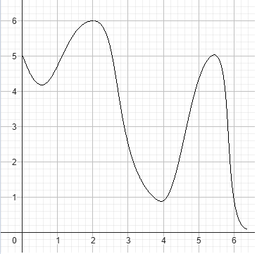 | 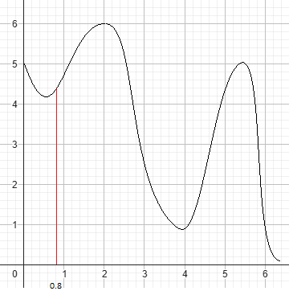 | 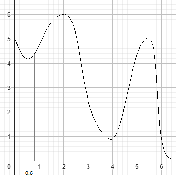 |

Prve okoline su nam $x_{left} = 0.6, x_{right} = 1.0$, pronalazimo da je vrednost u tački $x_{left}$ manje od trenutnog $x_{local}$ tako da uzimamo to rešenje kao novi optimum:

Sada posmatramo okolinu nove tačke $x_{local} = 0.6$, u okolini ove tačke prve dve vrednosti dobijene shake-om $x_{left} = 0.4, x_{right} = 0.8$ ni jedna nije novi optimum, ponavljamo shake,
$x_{left} = 0.2, x_{right} = 1.0$ ponovo nijedno rešenje nije bolje, prvo poboljšanje se dešava za $value = 2.5$ kada dobijamo da je $x_{right} = 3.0$:

| Prva okolina                                | Treća okolina                               | Peta okolina                                |
| ------------------------------------------- | ------------------------------------------- | ------------------------------------------- |
| 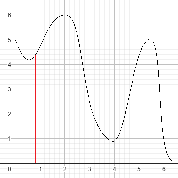 | 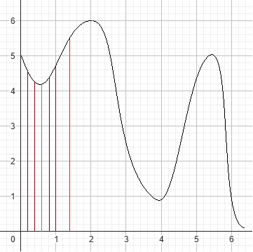 | 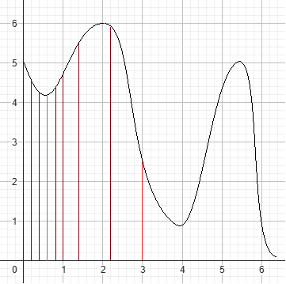 |

Dalje se isti postupak ponavlja dok ne dođemo do konačnog rešenja kada više ne možemo više da poboljšamo rešenje ili nam je ponestalo iteracija.

| Iteracija 2                                | Iteracija 6                              | Iteracija 7                               |
| ------------------------------------------ | ---------------------------------------- | ----------------------------------------- |
| 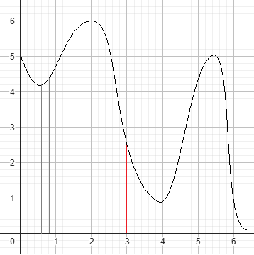 | 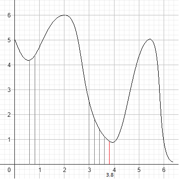 | 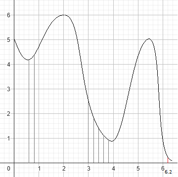 |

U ovom primeru imali smo sreće prilikom odabira svake sledeće okoline, ali da nismo dodali okolinu $2.4$ ovaj algoritam bi stao već nakon druge tačke.

Koristeći VNS mogli bi da rešimo i problem ranca, jedina razlika bi bila u predstavljanju rešenja: kao niz bitova, a funkcija shake-ovanja bi bila implementirana kao sve kombinacije kada negiramo 1, 2, 3...n bitova gde je n broj objekata koje možemo odabrati.

Na osnovu toga vidimo da je VNS zaista metaheuristika.

## 9.2 Population-based (P - Metaheuristika):
U ovu grupu spadaju sve one metaheuristike koje se bave unapređivanjem više rešenja njihovim simultanim evoluiranjem.

Primer ovakvih algoritama je algoritam jata ptica (Bird flocking PSO), funkcioniše po sledećem principu:
1. Izaberemo pseudo nasumično **n** rešenja, svako rešenje predstavlja pticu u prostoru rešenja koja se kreće ka optimalnom rešenju
2. Rešenja međusobno komuniciraju i prilagođavaju svoju putanju na sonovu:
	- svoje najbolje pozicije 
	- najbolje pozicije grupe 
	- inercije
3. Vremenom rešenja konvergira ka najboljem rešenju, a iscrtavanjem ovog algoritma rešenja izgledaju kao jato pica.

**Primer**: Tražimo minimum funkcije $f(x, y) = -20e^{-0.2\sqrt{0.5(x^2 + y^2)}} -e^{0.5(\cos{2\pi x} + \cos{2\pi y})} + e + 20$ poznata i kao ["Ackley function"](https://en.wikipedia.org/wiki/Ackley_function), tražimo rešenje na domenu $-5 \leq x,y \leq 5$. 
Uzimamo ovakvu funkciju pošto se ova vrsta algoritma uglavnom koristi za probleme sa **kontinualnim** domenom.

Hladnije boje na grafu predstavljaju niske vrednosti a toplije pretstvaljaju više vrednosti.

Prvo što smo rekli da želimo jeste da rasporedimo **n** ptica pseudo nasumično po  prostoru rešenja (domenu), dakle biramo $n$ pozicija { $(x, y) \| -5 \leq x,y \leq 5$ }. Dalje svakoj ptici izračunamo njenu lokalnu najbolju poziciju, njen vektor kretajna (inercija) i odredimo koje je to globalno najbolje rešenje (najbolje od svih lokalnih rešenje grupe).

| Funkcija                                   | 0-ta iteracija                                   |
| ------------------------------------------ | ------------------------------------------------ |
| 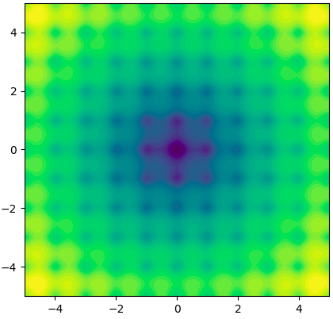 | 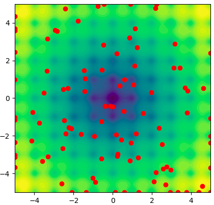 |

Već u prvoj iteraciji želimo adekvatno da pomerimo pticu na njenu sledeću poziciju. Imamo sledeće vrednosti **najbolju poziciju ptice ($p_{local}$)**, **najbolju poziciju grupe ($p_{global}$)** i **inerciju ptice ($v_i$)** kao i **trenutnu poziciju ptice ($p_{pos}$)**.
Novu poziciju dobijamo kao zbir vektora inercije ($v_i$), vektora $v_{global} = p_{global} - p_{pos}$ i vektora $v_{local} = p_{local} - p_{pos}$. 
Kako vektor ka globalnoj najboljoj poziciji ima verovatno najveću vrednost vrednost lokalnog rešenja ptice, biće zanemareno i time gubimo na osobini **intenzivikacije**. Da bi izbegli ovo želimo da množimo svaki vektor nekom konstantom koju možemo da menjamo, pa bi novu poziciju računali na sledeći način $v_i = c_iv_i + c_{local}v_{local} + c_{global}v_{global}$.
Kako bi još više poboljšali naše istraživanje domena želimo da uvedemo stohastičnosti, odabirom dva broja između 0 i 1 ($r_{local}$ i $r_{global}$), i time omogućimo **diverzifikaciju**. 
Konačna formula bi bila:\
$$v_i = c_iv_i + c_{local}r_{local}v_{local} + c_{global}r_{global}v_{global}$$\
Koačno ono što moramo da proverimo posle svake iteracije jeste da li je neko od novih lokalnih pozicija novo globalno najbolje rešenje. 

| iter > 5                                           | iter > 30                                            | iter > 50                                          |
| -------------------------------------------------- | ---------------------------------------------------- | -------------------------------------------------- |
| 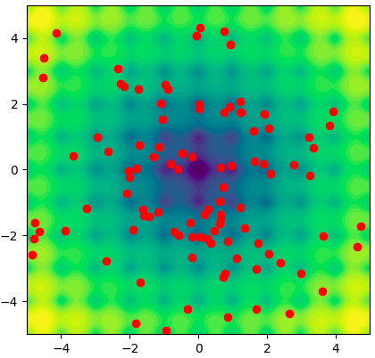 | 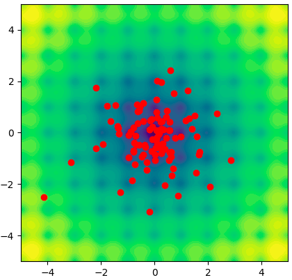 | 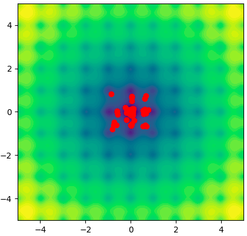 |

Primetimo da se vremenom sve tačke skupljaju u jednu tačku, ta tačka je zapravo minimum naše funkcije.

# 10. Evolutivna izračunavanja:

Evolutivno izračunavanje predstavlja proces poboljšavanja organizama ili sistema kroz takmičarsko okruženje, gde se najuspešnije jedinke prilagođavaju i prenose svoje karakteristike na buduće generacije. Poznati kao **Evolutivni algoritmi**.
**Evolutivni algoritmi (EA)** pripadaju **P-Metaheuristici**.

Očigledno inspirisano nekim istorijskim idejama o evoluciji:
- **Lamarkov pristup** - Organizmi mogu nasleđivati karakteristike stečene tokom života (npr. fizičke promene izazvane okruženjem).
- **Darvinov pristup** - Evolucija se odvija kroz prirodnu selekciju, gde samo najprilagođenije jedinke ("survival of the fittest") opstaju, dok se njihove karakteristike propagiraju kroz populaciju ukrštanjem i mutacijom.

### **Osnovni pojmovi:**
1. **Hromozom/Jedinka** - kodirano rešenje, uglavnom pseudo nasumično generisano, uglavnom u vidu niza bitova i slično. (kod genetskog programiranja GP, rešenja mogu biti stabla)
2. **Populacija** - skup više hromozoma
3. **Selekcija** - odabir jedinki koje će graditi sledeću generaciju
4. **Ukrštanje (Crossover)** - mešanje hromozoma neke dve jedinke
5. **Mutacija** - stohastička izmena delova hromozoma u nadi da izmene dodaju neke inovacije u populaciju

### **Pseudokod EA:**
 - **generiši inicijalnu populaciju** $P_{0}(n)$
 - **while** nisu zadovoljeni uslovi:
	- izračunaj **fitness** za svaku jedinku u $P_{t}(n)$
	- koristeći **crossover** napravi novu generaciju $P_{t+1}(n)$
	- pređu u sledeću generaciju $t = t + 1$
- **end**

Algoritam se završava ukoliko dođe do maksimalnog broja iteracija $t_{max}$, nađemo neko optimalno rešenje, nađemo rešenje i slično.

### **Algoritmi zasnovani na EA:**
1. **Genetski algoritmi GA** - genetski kod u obliku niza bitova
2. **Genetsko programiranje GP** - genetski kod u obliku stabla
3. **Evolutivno programiranje EP** - koristi samo mutaciju prilikom pravljenja sledeće generacije
4. **Evolutivne strategije ES** - gradi novu privremenu populaciju (drugačije veličine u odnosu na prethodnu generaciju), nad njom vrši ukrštanje i mutaciju i tek onda rangira sva rešenja i na osnovu njih gradi populaciju $P_{t+1}$. Rešenja u obliku niza realnih brojeva.
5. **Diferencijalna evolucija DE** - ne koristi optimizaciju gradijenta, pa funkcije ne moraju biti neprekidne ili diferencijabilne, već za svaku jedinku bira približne tri tačke a, b i c nasumično, koje ne smeju biti iste, i gradi novu tačku po formuli $x_{new} = a + F \times (v - c)$.
6. **Kulturna evolucija (CA)** - pored populacije sadrži dodatnu komponentu **belief space**, ta verovanja jedinke prihvataju ali i utiču na populaciju
7. **Koevolucija** - ne postoji evaluacija rešenja, već su rešenja ograničenja nekim drugim populacijma i njihovim ponašanjima.

### Kodiranje (hromozomi):
U prirodi hromozomi predstavljaju ceo DNK neke jedinke prilikom deobe ćelije. 
Svaki hromozom je sačinjen od velikog broja gena koji predstavljaju upustva za sintezu proteina, a proteini određuju anatomiju i fiziologiju organizma.

U kontekstu EA hromozomi su rešenja problema, a pojedini geni su karakteristike rešenja.

Kodiranje je uglavnom u obliku niza, može biti, kao u GP, nelinearno u obliku drveta.
Klasični primer je binarni vektor fiksne dužine.

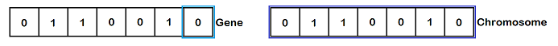

Za same gene možemo koristiti kao što je predstavljeno bitove, ali to mogu biti i celi brojeve ili realni brojevi...
Postoji i opcija gde se celi brojevi mogu predstaviti **Grejovim kodiranjem**, međutim danas je prihvaćeno kodiranje direktno odabranim tipom. 
Imamo u vidu da način kodiranja utiče na druge funkcije (mutacije i ukrštanja).
Prilikom kodiranja sa realnim brojevima ukoliko ih želimo predstaviti grejovim kodom moramo prihvatiti gubitak tačnosti.  Što veću tačnost želimo to su hromozomi duži a time evolucija sporija.

Čuveni problem **trgovačkog putnika** možemo rešiti koristeći kod koji sadrži nasumičnu permutaciju gradova, što je ukupna dužina ovakve permutacije manja to je vrednost fitness funkcije veća.  **Mutacija** može biti swapovanje neka dva grada.

### Fitness funkcija:
Prema Darvinovom modelu jedinke sa najboljim karakteristikama preživljavaju i dobijaju priliku da svoje gene prpagiraju u sledeću generaciju.
Kvantifikator ovakvih karakteristika u EA rešavamo **fitness** funkcijom,  uglavnom predstavlja baš funkciju cilja.

### Selekcija:
Faza u kojoj se se dešava odabir potomka. Ideja je da se onim boljim rešenjima da veća šansa da propagiraju svoje gene.

**Selekcioni pritisak** - predstavlja koliko vremena je potrebno da najbolje jedinke izgrade uniformnu populaciju. 
Pa bi najniži selekcioni pritisak bio da izmešamo populaciju i nasumično biramo jedinke.

Postoje dva osnovna pristupa selekciji:
1. **Turnir**:
	Ideja ovog pristupa jeste da izaberemo neki deo populacije, jedinke tog izabranog dela rangiramo, prema fitness-u, i izaberemo dve najbolje jedinke.
	U zavisnosti od veličine izabranog broja jedinki za turnir (k), koji može biti jednak ili manji od veličine populacije (n), imamo sledeće ishode:
	- k = 1: praktično je nasumičan odabir jedinki za crossover.
	- k < n: najbolji pristup, pošto i one dobre i one loše jedinke imaju šansu da budu izabrane.
	- k = n: u ovom slučaju uvek će biti izabrane one jedinke koje su najbolje u celoj populaciji, pa će se uniformna populacija steći jako brzo.
	Primetimo da što je veće **k** to je selekcioni pritisak veći.
2. **Rulet**:
	Zamišljamo ruletski točak gde je svaka pozicija u koju loptica može da upadne jedna jedinka. 
	Veličina pozicije za svaku jedinku je proporcijalna fitness vrednosti jedinke, ovo predstavlja verovatnoću njenog odabira. Kako verovatnoća svih mogućih događaja mora da bude jednaka 1, moramo normalizovati sve verovatnoće. 
	Pa u populaciji sa $n$ jedinki, za svaku jedinku računamo njenu verovatnoću:\
	$$p_x = \dfrac{f_x}{\sum_{i = 1}^n f_i}$$\
	Ovakav način selekcije nije najbolji, jer kako one jedinke koje imaju bolji fitness imaju veće šanse da budu odabrane, one lošije jedinke će ređe biti odabrane.
	Možda baš te lošije jedinke imaju neki gen koji nam je potreban u nekoj drugoj jedinci da bi dobili bolje rešenje.
	Jedna od modifikacija ruletske selekcije je **Stohastičko univerzalno uzorkovanje (SUS)**.

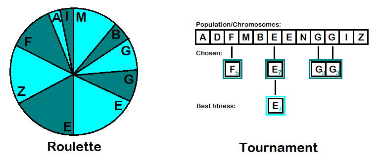

## 10.1 Genetski algoritmi (GA):
Glavna primena u diskretnom domenu. 
Mada su spori, ovi algoritmi su odlični za rešavanje kombinaornih problema.

### Pseudokod GA:
- **while** nije zadovoljen uslov:
	- odaberi roditelje 
	- uradi **crossover** i **mutation**
	- napravi $P_{t+1}$
- **end**

U osnovnom algoritmu GA ili SGA (Simple GA) čiji je pseudokod dat, selekcija roditelja se vrši tako što razbacama roditelje i za svaka dva imamo šansu da li će doći do ukrštanja, ako ne dođe do ukrštanja roditelji se samo prepisuju.

Jednostavni genetski algoritam koristi takozvani **Genracijski model (Generation GA - GGA)**, gde svaka jedinka preživi tačno jednu generaciju, odnosno cela populacija se zameni novom populacijom, odnosno potopmcima. Ovo je i tipično za GA.

**Generacijski jaz** određujemo koji deo populacije želimo da menjamo, ako je odnos stare i nove generacije manji od 1, samo se deo populacije menja (odnos nove i stare generacije 1 je GGA). Ovaj model se koristi u **Evolutivnim strategijama ES**.

**Model stabilnog stanja (Steady-State GA - SSGA)** generišemo jedno dete.

Primećujemo da se u druga dva modela dešava da samo kopiramo jedinke iz stare generacije, postoji još jedan princip po kom se čuva prvih **n** jedinki sa najboljim fitnessom ocaj princip se naziva **Elitizam**. 
Ideja je da čuvamo one jedinke koje su kvalitetne odnosno imaju dobar fitness, ali ne želimo da dozvolimo da one bolje jedinke nadvaladaju.

### Crossover i Mutacija:

**Ukrštanje (crossover)** - za svaka dva odabrana roditelja prave se dva deteta korišćenjem operacije ukrštanja. 
Ideja ukrštanja u smislu pronalaženja rešenja predstavlja intezifikaciju. Drugim rečima, ukrštanje je istraživanje prostora rešenja koja mogu nastati rekombinovanjem već postojećih rešenja. 
Mana ukrštanja je da ukoliko je optimalno rešenje "van dometa" trenutnog prostora rešenja nikada ga nećemo naći. Kako je "van dometa" određene osobine tog rešenja ne postoje ni u jednom od rešenja koja se nalaze u trenutnoj populaciji (lokalni minimum). 

**Crossover** u zavisnosti od problma može biti drugačiji ali se uglavnom izvršava na neki od sledećih načina:
1.  **Uniformno** - svaki gen jendog roditelja ima jednake šanse da se swapuje sa genom na istoj poziciji drugog roditelja.
2. **Jednopoziciono** - bira jednu poziciju, pa se prvi deo hromozoma prenosi od jednog roditelja, a drugi deo od drugog.
3.  **n - Poziciono** - bira više pozicija i deli oba gena na n+1 celinu nakon čega radi "cik-cak" swap delova gena.

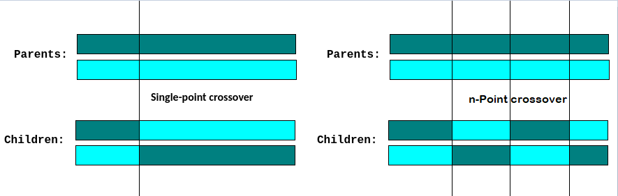

U slučaju realnog kodiranja koristimo **Aritmetičko ukrštanje**:
$$z_i = \alpha x_i + (1 - \alpha)y_i$$
$$0 \leq \alpha \leq 1$$
Alfa možemo da biramo za svaku generaciju, da postavimo na početku  ili da se menja kroz generacije. 
Jednostvano aritmetičko ukrštanje je kada izaberemo poziciju u kodu i odatle vršimo ukrštanje, celovito je kada je $k = 0$.

**Mutacija** prolazi svaki gen (bit) sa nekom verovatnoćom može ga izmeniti (negirati).
Ideja mutacije služi za diverzifikaciju, odnosno uvođenje novih osobina (rešenja) koje nisu mogle biti dobijene drugačije.
Drugim rečima, mutacija pokušava da proširi prostor rešenja koja imamo do sada. Mana mutacije je njena destruktivnost. Kako može da proširi skup rešenja tako može da ga umanji, ili ,ukoliko je previše učestala, da prosto ne dozvoli populaciji da konvergira ka bilo kom minimumu.

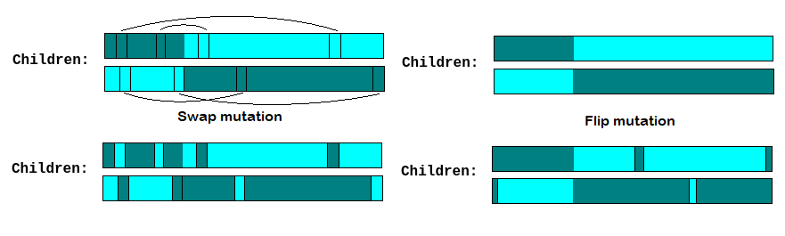

Kao što smo naveli već, mutacija kod kodiranja bitovima je flipovanje vrednosti bita.
Kada kodiramo realnim brojevima, neke od čestih mutacija:
1. **Dodavanje šuma (Gaussian mutation)**:
	Na broj dodajemo šum dobijen iz standardne normalne raspodele. 
	Računamo novo x na sledeći način: $x' = x + N(0, \sigma)$
2. **Uniformna mutacija**:
	Svakom genu je dodeljen opseg i nova vrednost mu se dodeljuje uniformno iz tog opsega. 
	Računamo novo x na sledeći način: $x' = U(a, b)$
3. **Menjanje gena za korak**
Ima više metoda ali ove su neke osnovne.

### Problem trgovačkog putnika (TSP):
Specifični problemi jesu oni zasnovani na **permutacijama**, jedan takav jeste problem trgovačkog putnika (TSP). 

Trgovac treba da obiđe sve gradove i da se vrati u početni grad (napravi ciklus), ali sme da poseti svaki grad jednom (sem početnog). (za 30 gradova 30! rešenja)

Kako trgovac treba da obiđe sve gradove znamo da jedino po čemu se rešenje može menjati jeste po redosledu obiđenih gradova. 
**Kodiranje**: 
Niz celih brojeva, gde svaki broj predstavlja drugačiji grad u grafu, a redosled graodva u nizu redosled posećivanja.

Pošto moramo da posetimo sve gradove znamo da standardna mutacija neće raditi u našem slučaju, jer mutacija može da zameni neki broj nekim drugim, takvo rešenje je nama nedopustivo.
**Mutacija**:
1. **Umetanje**: Izaberemo neka dva gena i drugi umećemo tako da stoji odmah posle prvog, svi ostali geni se pomeraju.
2. **Zamena**: Izaberemo dva gena i swapujemo ih.
3. **Inverzija**: Izaberemo segment hromozoma nad kojom vršimo inverziju
4. **Mešanje**: Izaberemo segment hromozoma i izmešamo gene unutar segmenta.

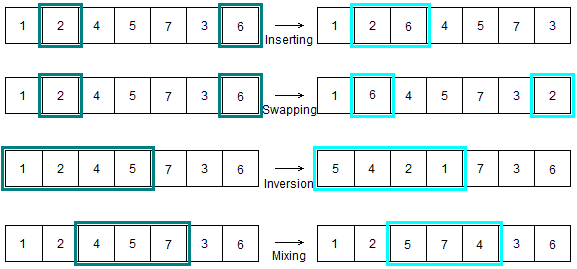

Sličan razlog kao kod mutacija, ako bi koristili standardno ukrštanje nastala bi nedopustiva rešenja koja mogu imati duple gradove.
**Ukrštanja**:
1. **Ukrštanje prvog reda**: Odaberemo segment hromozoma prvog roditelja, iskopiramo dati segment u prvo dete, nastavljamo desno od kopiranog segmenta i upisujemo sve one brojeve koji se nisu još pojavili u prvom detetu, sve dok se ne popune sve pozicije. Slično i za drugo dete.\
	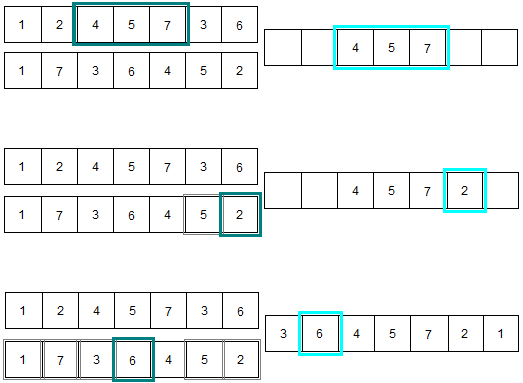

2. **Delimično ukrštanje (PMX)**: Odaberemo segment hromozoma prvog roditelja. Gledajući početak ovog segmenta idemo redom kroz isti segment drugog roditelja i gledamo u koji broj se broj drugog roditelja slika, posmatramo u koji se broj taj broj slika u drugom roditelju, postupak ponavljamo dok ne izađemo iz segmenta, ili ne prođemo sve elemente segmenta preko kog pišemo iz drugog roditelja. Nakon ovoga prepisujemo na slobodne pozicije brojeve iz drugog roditelja. Slično za drugo dete.\
	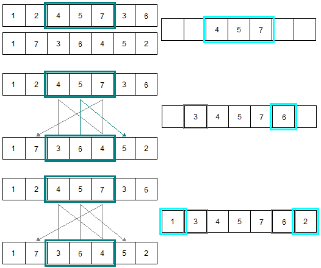

## 10.2 Genetsko programiranje (GP):
Osmišljen od strane **John R. Koza**, ovaj algoritam je inspirisan idejom da ako se računaru daju ulazni i izlazni parametri on bi trebalo da zna da napravi program koji rešava dati problem. Koristi princip GA, generacijska evolucija rešenja, odnosno GP je nadovezan na GA.

Idejno ovaj algoritam radi nad stablima, odnosno **Apstraktnim Sintaksnim Stablima (AST)**. Svaki program može se zapisati u sintaksnom stablu, primer može da bude neka jednačina $x^2 + 5x - 1 = 0$ drugačije zapisana i kao $xx + 5x - 1 = 0$, njeno sintaksno stablo bi izgledalo:\
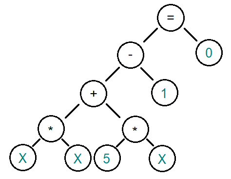

Mozemo primetiti da se promenljive nalaze na samim listovima **terminali** (konstante, promenljive) ovih stabala, dok se **funkcije** (operacije) nalaze u unutrašnjim čvorovima stabla.
Ovako bi izgledalo i stablo bilo kog drugog programa.

Znajući ovo evolucija programa bi se zasnivala kao i kod GA na crossover-u i mutacijama.
Prilikom mutacija nije dozvoljeno da list mutiramo tako da on postane neki od funkcija, operatora i slično...

Osnovni koraci:
1. Definisati skup **terminala**
2. Definisati skup **funkcija**
3. **Fitness** funkcija
4. Parametri kontrolisanja izvršavanja (veličina populacije, šansa mutacija, elitizam i slično)
5. Definisati kad se vrši **zaustavljanje** 

**Fitness**:
Funkcija čija nam vrednost predstavlja kvalitet sadačnjeg koda. U vrednost, odnosno kvalitet, ulazi i da li se sam kod kompajlira, koliko ima grešaka i slično.

**Crossover**:
Slično kao kod GA, uzmemo dva roditelja i biramo dve pozicije u roditeljima i podstabla krenuvši od tih pozicija swap-ujemo (**jednopoziciono ukrštanje**). 
Dugačije se ova operacija nad stablima zove i **Headless chicken** crossover.

| Odabir pozicija                 | Swap-ovanje podstabla           |
| ------------------------------- | ------------------------------- |
| 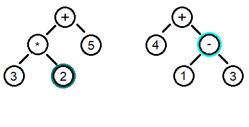 | 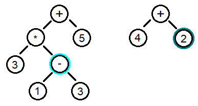 |

**Mutacija**:
U ovom slučaju kao i kod permutacija mormao da osmislimo pogodnu mutaciju, odnosno dozviljenu mutaciju.
Kao što smo prethodno primetili, listovi AST su promenljive i konstante, dok su unutrašnji čvorovi kao i koren čvora su funkcije, operacije i slično.

Unajući ovo neke dozvoljene mutacije bi bile:
1. **Mutacija listova**: kada znamo da je čvor list onda:
	- **Konstanta**: vrednost možemo da uvećamo ili smanjimo, zamenimo novim brojem ili zamenimo promenljivom...
	- **Promenljiva**: promenljivu možemo zameniti drugom promenljivom, uvođenjem nove promenljive ili zamenom promenljive konstantom...
2. **Mutacija unutračnjeg čvora**: zamenimo dati čvor drugom funkcijom, operacijom i slično, naravno moramo da zadržimo sintaksnu tačnost.
3. **Mutacija umetanjem novih podstabala**: poznato kao i **Grow**, jeste da dopustimo programu da izgradi pliće podstablo i da ga umetnemo na neku poziciju unutar AST-a programa.

| Mutacija listova               | Mutacija  operacije            |
| ------------------------------ | ------------------------------ |
|  |  |

Primetimo da ovaj algoritam u teoriji može da gradi program, međutim ovo je veoma težak postao, pošto moramo voditi računa o velikom broju sintaksnih i semantičkih pravila.
Doduše primenljivi jesu, i neki primeri jesu GP algortimi koji prave **regexe**, **aritmetičke formule**, **logičke formule**, neki lakši programi...

Dodatno o čemu moramo voditi računa prilikom rada algoritma jeste da ne dozvolimo algoritmu da pravi preduboka ili preširoka stabla, ovo rešavamo određenim ograničenjima koja če kvariti fitness funkciju ili potpuno brisati te delove stabla (nije najbolje rešenje).

**Primer**: recimo da imamo program koji rešava zadatke iz poznate [**Moj broj**](https://github.com/PetarP02/Genetic-Programming-GP) igre. U ovoj igri igraču je data neka tražena vrednost **b** kao i niz od 6 brojeva **nums**, od igrača se traži da koristeći osnovne operacije (+, -, \*, /), nađe traženi broj **b** tako da se ni jedan broj iz **nums** ne ponavlja. (igrač ne mora da iskoristi sve brojeve)
U ovom primeru, pretpostavimo da smo implementirali sve operacije kao binarno stablo, primetimo da nam nije optimalno da GP pravi preduboka stabla, ili stabla koja imaju više od 11 čvorova. 
Ovo nije magičan broj već znamo da ako stablo ima **n** listova onda znamo da maksimalan broj čvorova nivoa iznad je n/2, nivoa iznad n/4 .... 1 dakle formula popunjenog binarnog stabla bi bila $2n - 1$.
Samim tim ne bi želeli da nam GP pravi bilo koja stabla čiji je ukupan broj čvorova veći od 11.

# 11. Inteligencija grupa (SI - Swarm Intelligence):

Inteligencija grupa predstavlja proces u kojem jedinke istražuju svoja lokalna rešenja dok istovremeno komuniciraju i sarađuju sa ostalim članovima grupe. 
Kroz ovu interakciju dolazi do globalnog ponašanja, što omogućava grupi da kolektivno pronađe optimalno rešenje problema ili se prilagodi promenljivim uslovima u okruženju.

Jedna od bitnih osobina ovih algoritama je da su dinamički, odnosno ukoliko se prostor menja tokom rada algoritma, sposobni su da se prilagode i nađu novo rešenje.
Primer ovakvog ponašanja je ako postavimo kamen na put koji je oformljen ka hrani od strane mrava, brzo će naći novi optimalni put ka istoj toj hrani. 

Ovi algortimi pripadaju **P - Metaheuristikama**, i često se koriste na problemima **kontinualne** prirode. Osobina računara da brojeve čuvaju u ograničenoj memoriji, **No Free Lucnch (NFL)** teorema tvrdi da su svi **kontinualni** problemi rešavani na računarima ustvari **diskretni** problemi.

Razlika ovih algoritama od EA jeste u činjenici da jedinke ovde rade zajedno, tj. kreću se zajedno u smeru rešenja.

Razmena informacija unutar grupa može se vršiti na dva načina:
1. **Direktna** - jedinke moraju da interaguju na ličnom nivou sa drugim.
2. **Indirektno** - individulano ponašanje menja okruženje bez lične interackcije.

Neki primeri:
1. **Particle Swarm Optimization (PSO)**  - svaka čestica računa novu inerciju poštovaći najbolje rešenje grupe + njeno najbolje rešenje + kao i njenu staru inerciju.
2. **Ant colony optimization (ACO)** - svaki mrav ostavlja feromone prilikom traženja hrane, jačina feromona predstavlja kvalitet rešenja koji drugi mravi mogu i ne moraju da prate.
3. **Artificial Bee Colony (ABC)** - inspirisan grupama pčela u potrazi za nektarom, postoje tri vrste pčela **izviđači** (diverzifikacija), **zaposleni** (traže lokalna rešenja) i **posmatrači** (intenzivikacija, biraju gde će se vršiti istraživanje).
4. **Bacterial foraging optimization (BFO)** - bakterije se razmnožavaju u onim delovima gde je najbolje rešenje, u svakoj generaciji se odstranjuje polovina rešenja.

Još jedna korist SI algoritama jeste u izgradnji trodimenzionalnih tela na osnovu nekih pravila.

## 11.1  Particle Swarm Optimization (PSO):
U osnovnom PSO (Particle Swarm Optimization) algoritmu imamo grupu čestica, tako nazvanih zbog osobine da svaka jedinka ima brzinu i ubrzanje, u svakoj iteraciji se računa nova pozicija svake čestice. 
Inspirisani su kretanjem jata ptica i jatom riba.

Svaka čestica čuva **svoju najbolju poziciju čestice ($p_{local}$)**, **inerciju čestice ($v_i$)** kao i **trenutnu poziciju čestice ($p_{pos}$)**. 
Dok se glovalno pamti i po potrebi menja **najbolja pozicija grupe ($p_{global}$)**.

Formula po kojoj se računa nova inercija čestice:\
$$v_i = c_iv_i + c_{local}r_{local}v_{local} + c_{global}r_{global}v_{global}$$\
gde su:
1. $v_{global} = p_{global} - p_{pos}$ **vektor ka najboljem rešenju grupe**,
2. $v_{local} = p_{local} - p_{pos}$ **vektor ka ličnom najboljem rešenju**
3. $r_{global}$, $r_{local}$ brojevi između 0 i 1 koji uvode stohastičnost
4. $c_{local}$, $c_{global}$ i $c_{i}$ **konstante ubrzanja**, odnosno koliko će se stare vrednosti koristiti u računanju novog momentuma. 

Bitna je vrednost $c_i$ jer omogućava kontrolu intenzifikacije i diverzifikacije:
- $c_i \geq 1$ - brzina stalno raste i grupa divergira
- $c_i \leq 0$ - brzina se smanjuje vremenom, dok ne dostigne 0
- $0 \leq c_i \leq 1$ - čestice usporavaju pa konvergencija zavisi od $c_{local}$ i $c_{global}$, kako je $c_i$ između 1 i 0 znamo da će starije vrednosti momentuma imati manji uticaj na novu vrednost.
### Pseudokod PSO:
- generiši populaciju $P(n)$
- globalMin = min($P(n)$)
- **while** nisu zadovoljeni uslovi:
	- **for** p in $P(n)$ 
		- velocity_update()
		- position_update()
	- **end**
- **end**

Detaljno objašnjenje Algoritam jata prica (Birds flocking PSO) predstvaljeno je u 8.2.

## 11.2 Ant Colony Optimization (ACO):
Inspirisan ponašanjem kolonije mrava. Kada pronađu neku hranu mravi traže najoptimalniji, tj. najkraći put do te hrane. 

Prilikom kretanja kroz odabrani put svaki mrav iza sebe ostavlja feromone,  koji vremenom isparavaju. Drugi mravi imaju opciju da prate one puteve čiji su feromoni jači.
Prilikom povratka mrava nazad u mravinjak dodatno vraća feromone na isti taj put. Samim tim, ako je put kraći, mrav će češće da prelazi put i feromoni će biti snažniji i neće stići da ispare do kraja, što privlači druge mrave.

Ovakavo ponašanje možemo da iskoristimo u problemima sa grafovima, najbolji primer je **Traveling Salesman Problem (TSP)** gde tražimo najkraći put, a da pritom posetimo sve gradove.

U fazi inicijalizacije, **svakom mravu** je dodeljen **drugačiji čvor** kao početni, kako bi se izbeglo favoritizovanje rešenja na osnovu heuristike. Takođe

Svaki mrav čuva: 
1. **početnu poziciju (dodeljeni čvor)** - uvek kreće od ovog čvora
2. **trenutno rešenje (niz čvorova)** - resetuje se na početku svake nove iteracije
3. **dužinu puta** - resetuje se na početku svake nove iteracije
4. **depozit feromona (Q)** - konstanta koja se deli sa dužinom puta mrava, na osnovu čega se određuje količina feromona koja se ostavlja na tom putu.

Globalno se čuva **količina feromona na svim granama**.
### Pseudokod ACO:
- generiši populaciju $P(n)$
- inicijalizuj feromone na svim granama $pheromones(m)$ 
- **while** nisu ispunjeni uslovi:
	- **for** ant in $P(n)$
		- resetSolution(ant)
		- findSolution(ant)
	- **end**
	- updatePheromones($pheromones(m)$)
- **end**

**Primer**: TSP sa 10 gradova. U prvom delu koda inicijalizujemo svakog mrava, mrava ima onoliko koliko ima čvorova (bar je to praksa) i svaki mrav kreće iz drugačijeg čvora. 
Inicijalizujemo i količinu feromona na svim granama:

Nakon inicijalizacije, započinjemo petlju:
1. **resetSolution()** - nakon svake iteracije je potrebno da se resetuje rešenje, kako bi moglo da se nađe novo
2. **findSolution()** - mrav traži novo rešenje, odnosno novi put na osnovu feromona i odabrane heuristike. Proces odabira puta je sledeći:\
	Svaki mrav bira sledeći čvor dok nije posetio sve čvorove. Gledajući čvor na kom se trenutno nalazi ($i$ - čvor), mrav posmatra sve one koji su susedni i neposećeni ($j = susedi(i)$), bira put koji će preći na osnovu sledeće formule:\
	$$p_{i, j} = \dfrac{\tau_{i, j}^{\alpha}n_{i, j}^{\beta}}{\sum_{k = susedi(i)}^{n}{\tau_{i, k}^{\alpha}n_{i, k}^{\beta}}}$$
	\
	U prethodnoj formuli:
	- $\tau_{i, j}$ - predstavlja količinu feromona na grani $(i, j)$ u globalnoj promenljivoj $pheromones(m)$ 
	- $n_{i, j}$ - predstavlja odabranu heuristiku koja će se koristiti za računanje udaljenosti čvora $i$ od $j$. (u primeru koristimo heuristiku $n_{i, j} = \dfrac{1}{distance[i][j]}$) 
	- $\alpha$ - stepen koji odlučuje koliko će feromoni uticati na verovatnoću odabira tog čvora. Uglavnom uzima vrednost između $[1, 2]$.
	- $\beta$ - stepen koji odlučuje koliko će heuristika za optimalnost dužine puta uticati na verovatnoću odabirata tog čvora. Uglavnom uzima vrednost između $[2, 5]$.
	U odnosu na verovatnoće dobijene prethodnom formulom za sve susede, mrav stohastićki bira sledeći čvor. 
	Nakon odabira čvora, on se dodaje na rešenje i dužina puta se povećava za pređeni put.
3. **updatePheromones()** - na kraju svake iteracije $pheromones(m)$ se ažurira sledećom formulom:\
	$$pheromones(i, j) = (1 - p)pheromones(i, j) + \sum_{k = 1}^{n}{\Delta\tau_{i, j}^k}$$
	\
	U prethodnoj formuli:
	- $(1 - p)$ - koliko će feromoni posle svake iteracije da isparavaju, $p$ je predefinisano pre početka algoritma, vrednost između $[0, 1]$. Na ovaj način stari feromoni imaju manji uticaj na odabir sledećeg čvora čime samo rešenje vremenom konvergira.
	- $\Delta\tau_{i, j}^k$ - količina feromona koji mrav $k$ ostavlja na grani $(i, j)$, definisana sledećom formulom:\
   	$$\Delta\tau_{i, j}^k = \dfrac{Q}{pathLen(k)}$$
   	\
   	Q je predefinisana konstanta, uglavnom broj u intervalu $[1, 100]$. Delimo sa ukupnom dužinom puta koji je mrav $k$ prešao, radi postizanja prethodno navedene politike da kraći put ima snažniji miris feromona. 

| iter > 10                   | iter > 20                   |
| --------------------------- | --------------------------- |
|  |  |

Primetimo da one grane koje su češće posećivane se više ističu. 

| iter > 50                   | last iter                   |
| --------------------------- | --------------------------- |
|  |  |

Samim tim odabirom najboljih rešenja, taj put će se na samom kraju najviše istaći.

## 11.3 Artificial Bee Colony (ABC):
Algoritam je zasnovan na ponašanju pčela prilikom traženja polena. 
Pčele komuniciraju plesom, kojim govore ostalim pčelama gde se nalazi više polena, odnosno gde je kvalitetnije rešenje.

Pčele su podeljene na tri grupe:
1. **Employed bees (Zaposlene)** - ove pčele imaju dužnost da "iscrpljuju" resurs koje su one našle kao optimalan.
2. **Onlooker bees (Posmatrači)** - ove pčele na osnovu kvaliteta ostalih pčela i njihovog "plesa" biraju da li će nastaviti da iscrpljuju svoje resurse ili će preći na neki bolji resurs populacije.
3. **Scout bees (Izviđači)** - ovo su pčele koje nakon što su iscrpile svoj resurs biraju neki sledeći neistraženi resurs.

Dakle ideja je sledeća, zaposlene pčele prikuljaju polen (poboljšava lokalno svoje rešenje , tj. eksploatacija), dok pčele posmatrači nadgledaju i traže one pčele koje su našle najviše polena i šalju druge pčele da rade na tim pozicijama (konvergencija rešenja) i na kraju pčele istraživači traže druge izvore polena (eksploracija).

Mada su pomenute kao tri različite grupe pčela, ustvari svaka pčela unutar populacije menja svoju ulogu, pa se može reći i da prolazi kroz 3 faze ponašanja u svakoj iteraciji. 
### Pseudokod ABC:
- generiši populaciju $P(n)$
- nadji globalniMin = min($P(n)$)
- **while** nisu ispunjeni uslovi:
	- **for** bee in $P(n)$:
		- employedPhase(bee)
		- onlookerPhase(bee)
		- scoutPhase(bee)
	- **end**
- **end**

Svaka pčela ima sledeće informacije i funkcije:
- **pos** - trenutna pozicija pčele.
- **bestPos** - najbolja pozicija pčele.
- **failedImprovement** - ova promenljiva meri koliko dugo pčela nije poboljšala svoje rešenje ukoliko ovaj broj prekorači predodređenu vrednost **strpljenja** pčela postaje izviđač i uzima novo nasumično rešenje.
- **employedPhase()** - pčela vrši lokalnu pretragu svoje okoline, ukoliko ne nađe bolje rešenje failedImprovement se povećava.
- **onlookerPhase()** - pčela postaje posmatrač i ako naiđe na pčelu koja ima bolje rešenje od njenog najboljeg rešenja prebacuje se na tu poziciju.
- **scoutPhase()** - pčela postaje izviđač onog momenta kada se pređe strpljenje.

**Primer**: Tražimo minimum funkcije $f(x, y) = 20 + (x^2 - 10\cos(2\pi x) + y^2 - 10\cos(2\pi y))$ poznata i kao ["Rastrigin function"](https://en.wikipedia.org/wiki/Rastrigin_function), tražimo rešenje na $-5.12 \leq x,y \leq 5.12$. 

Hladnije boje na grafu predstavljaju niže vrednosti a toplije prtstavljaju više vrednosti.

U prvom koraku pseudokoda videli smo da postavljamo sve pčele na pseudo-nasumične pozicije, računamo redom fitness svake i uzimamo onu vrednost koja je globalno najbolja.
Pravimo $n$ pčela na dopuštenom domenu, { $(x, y) | -5 \leq x,y \leq 5$ }. 

| Funkcija                          | 0-ta iteracija                |
| --------------------------------- | ----------------------------- |
|  |  |

U prvoj iteraciji za svaku pčelu vršimo sve tri faze. 
1. **Employed Phase**:\
	Pčela istražuje okolinu svog trenutnog rešenja koristeći trenutno najbolje globalno rešenje pouplacije:\
	$$p_{new} = p_{old} + \phi_i (p_{localBest} - p_{random})$$
	\
	u ovoj formuli $\phi_i$ je vrednost između -1 i 1, koja uvodi stohastičnost u celu pretragu, a $p_{random}$ predstavlja pseudo-nasumičnu poziciju neke od pčela iz populacije. 
	Ukoliko je novonađena pozicija kvalitetnija, pored izmene najboljeg lokalnog rešenja, proverava se da li je globalno bolja.
2. **Onlooker Phase**:\
	Pčela bira neku od pčela po principu ruleta, gde svaka od pčela ima šansu da bude izabrana na osnovu sledeće formule:\
	$$p_i = \dfrac{f_i}{\sum_{i = 1}^n f_i}$$
	\
	Ukoliko je vrednost najboljeg rešenja izabrane pčele bolja od nabolje vrednosti pčele posmatrača, pčela posmatrač odbacuje sve resurse i prebacuje se na izabranu pčelu, inače ništa se ne dešava.
3. **Scout Phase**:\
	Ukoliko se kvalitet rešenja pčele nije poboljšalo predodređen broj iteracija pčela bira neku nasumičnu poziciju unutar domena.

| iter > 5                       | iter > 20                       | iter > 30                      |
| ------------------------------ | ------------------------------- | ------------------------------ |
|  |  |  |

# 12. S - Metaheuristike:

Prethodno opisani kao metaheuristike koje se bave jednim rešenjem koje konstantno unapređuju.
U poglavlju 8.1 opisna je VNS metaheuristika, a ovde ćemo dodatno opisati Simulirano kaljenje (Simulated Annealing) i Tabu pretragu (Tabu search).

## 12.1 Simulated Annealing (SA):
U obradi čelika teknika **kaljenja** funkcioniše po principu zagrevanja, čestice bro menjaju kristalnu rešetku i svoje pozicije, i ponovnog hlađenja, čestice zauzimaju pozicije, čelika. Ovaj proces, sporog hlađenja, dovodi do ojačavanja tvrdoće čelika.

Po uzoru na ovaj proces nastala je i optimizacija Simuliranog kaljenja. 
Na početku algoritma "temperatura" sistema je podešena na 1 koja se vremenom smanjuje.
Temperatura u optimizaciji predstavlja verovatnoću uzimanja lošijeg rešenja, kako se temperatura smanjuje vremenom ta verovatnoća se smanjuje, što simulira proces kaljenja.

### Pseudokod SA:
- generiši rešenje $x_{local}$
- definišemo i = 0, $x_{best}$
- **while** nisu ispunjen uslovi:
	- $x_{i+1} = move(x_{local})$ 
		- **if** $f(x_{i+1}) < f(x_{best})$:
			- $x_{best} = x_{i+1}$
			- $x_{local} = x_{i+1}$
		- **else if** $random() < temp$(i):
			- $x_{local} = x_{i+1}$
		- **end**
	- i = i + 1
- **end**

**Primer:** Tražimo minimum funkcije $f(x, y) = 20 + (x^2 - 10\cos(2\pi x) + y^2 - 10\cos(2\pi y))$ poznata i kao ["Rastrigin function"](https://en.wikipedia.org/wiki/Rastrigin_function), tražimo rešenje na $-5.12 \leq x,y \leq 5.12$. 

Hladnije boje na grafu predstavljaju niže vrednosti a toplije prtstavljaju više vrednosti.

Na samom početku programa pravimo neko pseudo-nasumično rešenje, postavljamo to rešenje kao najbolje i brojač iteracija.

U našem kodu kao uslov zaustavljanja biramo broj iteracija, mada bi možda u ovom primeru bilo bolje da posmatramo kada je razlika najboljeg i trenutnog novog rešenja $< \epsilon$. 

Na slikama crvena tačka predstavlja novo nađeno bolje rešenje, dok će crne tačke predstavljati rešenje koje je uzeto a koje je lošije nego najbolje.

| Funkcija                           | 0-ta iteracija                 |
| ---------------------------------- | ------------------------------ |
|  |  |

U sledećem koraku biramo novu tačku u okolini sadašnje tačke koju posmatramo. Sam proces nalaženja nove tačke može se raditi na različite načine u zavisnosti od problema. 
U našem slučaju koristili smo pomeraj po uniformnoj raspodeli na intervalu [-1, 1], odnosno:\
$$x_{i+1,j} = x_{local,j} + U(-1, 1), j\in[0, n)$$\
gde je **n** veličina prostora u kom stražimo rešenje.

Kada smo našli novo rešenje moramo da vidimo da li je ono bolje ili lošije od prethodnog najboljeg. U slučaju da je bolje čuvamo to repešenje kao najbolje povećavamo brojač i = i+1 zatim tražimo sledeće rešenje preko iste funkcije **move()**. 
U slučaju lošijeg rešenja koristimo **temperaturu** da bi odredili da li uzimamo rešenje ili ne.
Temperatura može da bude bilo koja opadajuća funkcija, neke navedene su:
- Logaritamska:\
$$temp(i) = T_0*\frac{ln(2)}{ln(i+1)}$$
- Brzo kaljenje:\
$$temp(i) = \frac{T_0}{i+1}$$

Ove funkcije na početku tolerišu sva lošija rešenja dok se kasnije, kako prolaze iteracije, ta tolerancija smanjuje. Ovaj princip u isto vreme na samom početku praktikuje eksporaciju a kasnije i eksploataciju prostora rešenja.

| iter = 1                        | iter > 20                        | iter > 50                        |
| ------------------------------- | -------------------------------- | -------------------------------- |
|  |  |  |

Vidimo da iako je lošije rešenje u često algoritam izabere to rešenje dok se to kasnije menja.
U poslednjim iteracijama:

| iter > 150                        | iter final                          |
| --------------------------------- | ----------------------------------- |
|  |  |

## 12.2 Tabu Search (TS):
Tabu pretraga temelji se na samom značenju reči "tabu", što u ovom kontekstu označava nešto zabranjeno. Termin potiče iz jezika naroda Tonge.

Slično ovoj definiciji, i algoritam tabu pretrage funkcioniše tako što nameće ograničenja koja sprečavaju izbor određenih rešenja tokom pretrage. Ključni aspekt ovog pristupa jeste korišćenje memorije, kratkoročne ili dugoročne, koja pamti već posećena rešenja i na taj način sprečava njihovo ponavljanje. Ove strukture se nazivaju **tabu liste**, i upravo one čine ovaj algoritam specifičnim.

Zabranom povratka na prethodno posećena rešenja, algoritam je prisiljen da istražuje nove oblasti u prostoru rešenja, čime povećava šanse za pronalaženje boljeg rešenja. Međutim, zbog velikog broja potencijalnih rešenja, nije praktično pamtiti sva posećena. Umesto toga, u praksi se najčešće pamte samo ključne tačke ili se koristi ograničena memorija koja evidentira samo nekoliko poslednjih rešenja.

Važno zapažanje kod ovog algoritma jeste potreba da se u određenim trenucima prekrše tabu pravila. Ova praksa, poznata kao **kriterijum težnje** (**aspiration criteria**), omogućava izbor rešenja koje je označeno kao tabu, ali koje nudi značajno bolje rezultate od trenutnog najboljeg rešenja. Ovaj pristup osigurava fleksibilnost algoritma i pomaže u izbegavanju lokalnih minimuma.

Najvažniji deo tabu pretrage jeste definisanje načina pronalaženja susednih rešenja i odabira odgovarajućeg regiona za pretragu. Ove definicije su specifične za svaki problem i ključne su za uspešno funkcionisanje algoritma.

### Pseudokod TS:
- generiši rešenje $x_{local}$
- definiši $x_{best}$ i $T.append(x_{local})$
- **while** nisu ispunjeni uslovi
	- $x_{local} = neighbour(T, x_{local})$
	- **if** $f(x_{local})$ < $f(x_{best})$
		- $x_{best} = x_{local}$
	- **end**
	- $T.append(x_{local})$
- **end**

**Primer:** Tražimo minimum funkcije $f(x, y) = 10 + (x^2 - 10\cos(2\pi x)$ poznata i kao ["Rastrigin function"](https://en.wikipedia.org/wiki/Rastrigin_function), tražimo rešenje na $-5.12 \leq x \leq 5.12$.

Ljubičastom bojom predstavljamo trenutno lokalno rešenje, crvenom bojom najbolje nađeno rešenje i sivom prethodna rešenja.

Po početku algortima inicijalizujemo početno rešenje:

| Funkcija                           | iter = 0                       |
| ---------------------------------- | ------------------------------ |
|  |  |

Na dalje tražimo sledeće rešenje koristeći se formulom kao u primeru za SA:\
$$x_{i+1} = x_{local} + U(-1, 1)$$\
Ono što dodatno proveravamo jeste da li je ovo rešenje u listi $T$ (tabu lista), ako jeste tražimo sledeće rešenje po istoj formuli. Možemo dodati dodatan uslov da, iako rešenje nije u tabu listi, ako je lošije od ostalih rešenja u tabu listi ipak ne bude izabrano.
Kako ovde može doći do beskonačne petlje uvodimo dodatan uslov šanse da se ipak uzme tabu rešenje.

| inter = 10                       | iter = 30                        | iter = 60                        |
| -------------------------------- | -------------------------------- | -------------------------------- |
|  |  |  |

Vidimo da su tačke iz starijih iteracija obrisane. Ne želimo da čuvamo previše informacija pa brišemo sve tačke koje su starije od **m** iteracija.

| iter = 100                        | iter = 350                        |
| --------------------------------- | --------------------------------- |
|  |  |

# 13. Veštačke neuronske mreže (ANN):

Ove mreže oponašaju način na koji ljudski mozak obrađuje informacije, koristeći veštačke neurone koji obrađuju informacije kroz slojeve.\
Bioloski neuroni funkcionišu po principu primanja signala, a na osnovu snage tih signala odgovaraju i prenose signal dalje.\
Prihvatanje signala vrši se specifičnim delom neurona **dendrita**, na dalje signal putuje kroz neuron, ili **akson**, koji se ostalim neuronima prenose putem **aksonskog završetka**. Tamo gde se dva neurona povezuju naziva se **sinapsa**.\
Češćim aktiviranjem neurona vremenom dolazi do **sinaptičkog odsecanja** čime se odstranjuju nepotrebne veze i time smanjuje odliv snage signala.\

Nalik biološkim neuronima, veštački neuroni se sastoje iz **ulaznih parametara**, ulazni signali, koji se uglavnom označavaju sa **x**, **težine** svakog pojedinačnog signala označavamo sa **w** (može se gledati kao pristrasnost neurona na određene signale), merilo da li je signal dovoljno jak za njegovu aktivaciju postavlja se korišćenjem posebne promenljive pristrasnosti (**bias**), dodatno sadrže i **aktivacionu funkciju** koja omogućava neuronu da oformi aproksimaciju koja nije linearna.\
Izlaz neurona povezuje se na ulazne parametre svih neurona nakon njega, što se postiže njihovom podelom na slojeve.\
Prvi sloj nazivamo **ulaznim (input layer)**, konačni nazivamo **izlaznim (output layer)** i među-sloj nazivamo **sakrivenim (hidden layer)**.

Za vreme treniranja modela koristimo se **trening** i **tester** skupovima. Ovi skupovi su disjunktni, a pojedinačno trening, kako sam naziv kaže, koristi se u periodu treniranja našeg modela da predvidi klase, dok test skup služi kao merilo kvaliteta istreniranog modela.

## 13.1 Linearna regresija:

Da bi razumeli osnovu veštačke neuronske mreže, moramo da razumemo kako radi neuron, a za to nam je potrebno poznavanje linearne regresije.\
Linerna regresija najjednostavnije objašnjeno jeste postavljanje prave, hiperravni... tako da kasnije možemo predvideti vrednosti za neke nove parametre, a da pritom greška predviđene vrednosti bude što manja.\
Radi lakše vizualizacije bavićemo se problemima sa jednim parametrom. (x1)\
Ove formule grade se statističkom analizom neke velike baze podataka. Kako predstavljaju linearne funkcije, u našem slučaju pravu ($y = mx + k$) možemo ih predstaviti sledećom formulom:\
$$y_i = \beta_0 + \sum_{j = 1}^n{\beta_jx_j} + \epsilon_i$$\
Epsioln predstavlja grešku, odnosno koliko se $y_i$ nalazi daleko od trenutne aproksimacije, $\beta_0$ je slobodan parametar koji nam omogućava da pomeramo našu pravu, hiperravan.\
Kako tražimo onu pravu koja nam razdvaja podatke na neke dve celine, očigledno je da želimo da ta prava greši što manje. Imajući ovo u vidu, cilj nam je da $\epsilon$, greška, bude što manja za svaki parametar. Želimo da minimizujemo grešku predviđene vrednosti ($y_p$) i njene realne vrednosti ($y$).\
$$\epsilon_i = y_i - (\beta_0 + \beta_1x_i)$$\
Ili lakši zapis:\
$$\epsilon_i = y_i - y_{p, i}$$
Da bi minimizovali grešku, zanima nas ukupna greša, za šta koristimo sumu kvadratnih greški:\
$$SSE = \sum_{i=1}^n{(y_i - y_{p, i})^2}$$\
Pošto nas zanima kada je greška najmanja, zanima nas za koje vrednosti $\beta_0$ i $\beta_1$, funkcija ima najmanju vrednost. Ovo možemo naći preko izvoda funkcije SSE, odnosno:\
$$\frac{d SSE}{d\beta_0} = 0, \frac{d SSE}{d\beta_1} = 0$$\
Kako je:\
$$SSE = \sum_{i=1}^n{(y_i - \beta_0 - \beta_1x_i)^2}$$\
I dobijamo sledeće dve formule:\
$$-2\sum_{i=1}^n{(y_i - \beta_0 - \beta_1x_i)} = 0$$\
$$-2\sum_{i=1}^n{x_i(y_i - \beta_0 - \beta_1x_i)} = 0$$\
Sređivanjem funkcija dobijamo:\
$$n\beta_0 + \beta_1\sum_{i=1}^n{x_i} = \sum_{i=1}^n{y_i}$$\
$$\beta_1\sum_{i=1}^n{x_i^2} + \beta_0\sum_{i=1}^n{x_i} = \sum_{i=1}^n{x_iy_i}$$\
Delimo sve sa ukupnim brojem podataka kako bi dobili prosek:\
$$\beta_0 + \beta_1\overline{x} = \overline{y}$$\
$$\beta_0\overline{x} + \beta_1\overline{x^2} = \overline{xy}$$\
Pretvorili smo problem u sistem jednačina sa dve nepoznate, što umemo da rešimo.\

**Primer:** Tražimo pravu koja najbolje aproksimira zavisnost siromašnosti i količine rođene dece u određenom periodu života, nas konkretno zanima između 15 i 17.

Prvo računamo $\overline{x}, \overline{y}, \overline{xy}$ i $\overline{x^2}$, redom $\overline{x} = 13.11764, \overline{y} = 22.28235 , \overline{xy} = 316.92431, \overline{x^2} = 190.00863$.\
Ostaje nam samo da izračunamo sledeći sistem jednačina:\
$$\beta_0 + \beta_1{*}13.11764 = 22.28235$$\
$$\beta_0{*}13.11764 + \beta_1{*}190.00863 = 316.92431$$\
Konačne vrednosti $\beta_0 = 4.26729$ i $\beta_1 = 1.37335$.

| postavka                                        | regresija                                        |
| ----------------------------------------------- | ------------------------------------------------ |
|  |  |

### Pristup maksimalne verodostojnosti:
Težina može se računati korišćenjem matrica. Kada pogledamo modele možemo ih zapisati na sledeći način:\
$$Y = Xw + \epsilon$$\
**Y** je matrica svih rešenja, **X** vrednosti svih parametara a prva kolona niz jedinica zbog slobodnog parametra i **w** su sve $\beta$ težine . Problem se svodi na:\
$$min_{w}||Y - Xw||^2$$\
Ideja od koje se ovde polazi jeste pretpostavka da oko naše aproksimacije, korišćenjem jedne linearne funkcije, su parametri najviše koncentrisani, pretpostavimo da su normalno raspoređeni. Naglasak na predpostavku koja može biti loša.\
Kada pričamo o normalnoj raspodeli bitno je da znamo njen prosek ($\mu$) i devijaciju ($\sigma^2$). U našem slučaju pošto kažemo da postoji neka linija koja najbolje aproksimira podatke sam prosek se menja u odnosu na položaj i nagib te prave, odnosno $\mu = w\cdot x$.\
Nas zanima kolike su šanse da podaci upadnu u našu raspodelu:\
$$L(w) = P_{w}(y_1, y_2, y_3, ..., y_n | x_1, x_2, x_3, ..., x_n)$$\
Što je proizvod svih šansi za pogodak vrednosti iz naših podataka:\
$$L(w) = \prod_{i = 1}^{n}{P_w(y_i | x_i)}$$\
Kako su sve vrednosti verovatnoće, koja može da uzme samo brojeve između [0, 1], ovo jako brzo ide ka nuli, zbog čega tražimo logaritam ovog prozvoda što ga svodi na sumu logaritama:\
$$L(w) = \sum_{i = 1}^{n}{log(P_w(y_i | x_i))}$$\
Pošto želimo da naš model bude što bolji želimo da ove šanse budu što veće zbog čega maksimizujemo ovu sumu. Ovo je isto kao da tražimo minimum $-L(w)$:
$$min_w(-\sum_{i = 1}^{n}{log(P_w(y_i | x_i))})$$\
Sada menjamo verovatnoću $P_w$ sa pretpostavljenom normalnom raspodelom, i uproštavamo:
$$min_w(-\sum_{i = 1}^{n}{log(\frac{1}{\sqrt{2\pi\sigma^2}}e^{\frac{(-y_i - wx_i)^2}{2\sigma^2}})})$$\
$$min_w(\frac{1}{2}\sum_{i = 1}^{n}{2\pi\sigma^2} + \sum_{i = 1}^{n}{\frac{(y_i - wx_i)^2}{2\sigma^2}})$$\
Kako tražimo minimum za težine **w**, u dobijenoj formuli ničemu ne doprinosi prava suma, kao ni imenilac druge sume, pa možemo napisati da tražimo minimum sldeće funkcije:
$$min_w(\sum_{i = 1}^{n}{(y_i - wx_i)^2}) \equiv min_w||Y - Xw||^2$$
\
Kako moramo da minimizujemo tražimo izvod formule:\
$$\frac{\partial}{\partial w_j} = -2 \sum_{i = 1}^{n}{x_{i,j}(y_i - wx_i)} = 0$$
\
$x_{i, j}$ predstavlja svaki j-ti parametar podatka i, dalje vraćamo se na matrični oblik, izvodimo formulu za **w**.
$$X^T(Y - Xw) = 0$$\
$$X^TY = X^TXw$$\
$$w = (X^TX)^{-1}X^TY$$\
Ovo je i konačna formula za nalaženje svih težina **w**. Kako se ovde pojavljuje takozvani **pseudo inverz** ne moramo da brinemo o postojanju inverza matrice X.

Naravno postoje slučajevi kada ovakva linerana funkcija nije dovoljno dobra za aproksimaciju podataka. U ovakvim situacijama parametre možemo ubacivati kao vrednosti odabranih elemetarnih funkcija, npr. :\
$$y_i = \beta_0 + \beta_1(x_i)^2 + \epsilon_i$$\
U tom slučaju formula za $\beta_1$ bi bila drugačija zbog kvadrata. Bitno je naglasiti da ovakav model idalje spada u linearan nebitno od toga što koristi nelinearnu funkciju.

## 13.2 Veštački neuron (AN):

Kao što smo već rekli neuron se sastoji iz **ulaznih parametara** $x_1, x_2, ..., x_n$ koji se množe njihovim dodeljenim **težinama** $w_1, w_2, ..., w_n$ i dodatni slobodan parametar koji određuje da li je neuron aktivan ili ne, pristrasnost **(bias)**. Primetimo da ovakav neuron je obična linearna regresija, pa bi ovakva ANN izgledala kao mnogo kompleksnija verzija linearne funkcija.\
Kako bi se rešili linearnosti svaki neuron je obavijen nelinearnom funkcijom po izboru na određenim slojevima.\
$$y = g(\sum_{i=1}^n{w_ix_i + b})$$\
Radi lakšeg zapisa od sad $w_0$ predstavlja slobodan član, odnosno **pristrasnost**, a $x_0$ uvek ima vrednost 1:\
$$y = g(\sum_{i=0}^n{w_ix_i})$$\

| Biološki | Veštački                                |
| -------- | --------------------------------------- |
|          |  |

Težine ulaznih parametara po inicijalizaciji neurona uzimaju vrednost iz standardne noramalne raspodele:\
$$w_i\sim\!N(0, 1)$$\
Vrdnosti pristrasnosti **b** postavljamo na 0.\
Neke od aktivacionih funkcija su **sigmoidna funkcija**, **hiperbolički tangens** i **ispravljena linearna jedinica (ReLU)**, redom $\sigma(x) = \frac{1}{1 + e^{-x}}$, $tang(x) = \frac{e^{2x} - 1}{e^{2x} + 1}$ i $ReLU(x) = max(0, x)$.

| $\sigma$                        | tanH                         | ReLU                         |
| ------------------------------- | ---------------------------- | ---------------------------- |
|  |  |  |

Ovo omogućava neuronskoj mreži da se bolje prilagodi podacima.

Sigmoidna funkcija koristi se i u izlaznom sloju neuronske mreže, popularna je i softmax funkcija.

Slojevi mreže prave se od više ovakvih neurona, sem u ulaznom sloju koji je predstavljen kao niz ulaznih parametara funkcije.

## 13.3 Feed-Forward i Backpropagation koraci:

**Feed-Forward korak** je ubacivanje parametara u model i posmatranje šta model vraća, za vreme treniranja modela.\
Po inicijalizaciji mreže, kako su sve težine nasumično odabrane, model će grešiti. Kao merilo greške može se koristiti srednja kvadratna greška (**MSE**):\
$$MSE = \frac{1}{n}\sum_{i = 1}^{n}{||o_i - t_i||^2}$$\
U ovoj formuli $o_i$ predstavlja očekivanu vrednost za ulazne parametre, a $t_i$ dobijenu vrednost, može se koristiti isključivo za regresiju pošto sama formula ne razlikuje klase. Ovom formulom računamo ukupnu grešku za one podatke sa kojim treniramo datu mrežu. Znajući ukupnu grešku, jasno je, da bi model pretpostavljao što bolje, moramo minimizovati ovu grešku, podesiti težine i pristrasnost svakog neurona na one koje daju najmanju grešku, odnosno minimizujemo svaki parametar. Minimizaciju izvodimo gradijentnim spustom:\
$$\nabla MSE = (\frac{\partial MSE}{\partial w_1}, \frac{\partial MSE}{\partial w_2}, \frac{\partial MSE}{\partial w_3}, ..., \frac{\partial MSE}{\partial w_l})$$\
$l$ je broj težina svakog neurona, zajedno sa pristrasnostima neurona (koje ovde predstavljamo kao $w_i$).\
Izračunavanjem gradijenta vršimo gradijentni spust:\
$$\Delta w_i = -\gamma \frac{\partial MSE}{\partial w_i}, i = 1, ..., l$$\
$\gamma$ je brzina učenja (learning rate), koji definiše veličinu koraka u svakoj iteraciji.\
Proces popravljanja promenljivih se naziva **backpropagation**.

Pitanje je kako da efektivno računamo ovaj gradijent.\
Imajmo u vidu da u neuronu imamo $l$ ulaznih parametara, isto toliko težina, vrednost linarne funkcije i vrednost aktivacione funkcije. Posmatrajmo sad izvod po nekom od težina, za ulazne podatke $x_1, x_2, ..., x_l$:\
$$\frac{\partial MSE}{\partial w_{k}} = -\frac{2}{m}\sum_{i = 1}^{m}\pmatrix{{||o_{i} - t_{i}||}{\cdot}g^{'}(\sum_{j = 1}^{l}{w_{j}x_{i, j}}){\cdot}x_{i, k}} = 0$$\

| Veštački neuron                         | B-diagram                       |
| --------------------------------------- | ------------------------------- |
|  |  |

Sama vrednost izvoda funkcija se računa po prolasku kroz sam neuron za vreme feed-forward koraka, dok se za vreme **backpropagation** koraka ove vrednosti koriste.\
Kada minimizujemo bilo koju težinu, jasno je da ostaje samo vrednost ulaznog parametra, pošto važi:\
$$\frac{\partial(w_1x_1 + w_2x_2 + b)}{\partial w_1} = x1 + 0 + 0$$\
pa je rešenje samo množenje izvoda aktivacione funkcije sa vrednošću ulaznog parametra. Sličan je i u slučaju minimizacije pristrasnosti jer je vrednost ulaznog parametra jednaka 1.\
Za jedan neuron prvog sloja u koraku bakctracking-a, matrično ovo zapisujemo na sledeći način:\
$$\pmatrix{w_{0}\\ w_{1}\\ w_{2}\\ {.}\\ {.}\\ w_{l}} = -\gamma\sum_{i = 1}^{m}\pmatrix{-{||o_{i} - t_{i}||}f^{'}\pmatrix{{1} \\ x_{i, 1} \\ x_{i, 2} \\ {.}\\ {.}\\ x_{i, l}}}$$\
$m$ je oznaka za broj podataka sa kojim učimo, tako da svako $x_{i, k}$ predstavlja ulaznu vrednost ovog neurona na k-tom ulazu za i-ti podatak. 
Imajmo u vidu da u pravim mrežama nemamo samo jedan neuron i postoji proces vraćanja unazad kroz slojeve. Dakle kada izračunamo jedan sloj prelazimo, ako on postoji, na onaj pre njega i računamo na sličan način. Ono o čemu moramo da vodimo računa jeste da informacije sloja ispred prenosimo unazad, koristimo respektivno šta smo dobili za određenu težinu grane i preko te grane vraćamo na neuron pre da se koristi u daljem računanju. Odnosno ako bi postojao sloj pre neurona za koji smo napisali prošlu formulu, za neuron vezan za granu čija je težina ${w_{2}}$ formula za težine tog neurona na sloju pre bi bila:\
$$\pmatrix{w_{0}\\ w_{1}\\ w_{2}\\ {.}\\ {.}\\ w_{j}} = -\gamma(-{||o_{i} - t_{i}||}f^{'}x_{i, 2})\sum_{i = 1}^{m}x_{i, 2}^{'}$$
\
kako svaki neuron ima istu strukturu jasno je da je $x_{i, 2}^{'} = g^{'}(\sum_{i=0}^j{w_ix_i})$.\
Kako bi sve ovo preneli u matrično množenje sve izračunate vrednost jednog sloja prenosimo u onaj pre koristeći dijagonalnu matricu dimenzija $[j {\times} j]$, j je broj ulaznih parametara zajedno sa bias, koja po dijagonalama ima onu vrednost izvoda po težini grane asocirane sa tim neuronom u sloju iznad:\
$$UpperLayer = \pmatrix{-{||o_{i} - t_{i}||}f^{'}x_{i, 1} & {0} & {.} & {.} & 0 \\ 0 & -{||o_{i} - t_{i}||}f^{'}x_{i, 1} & {.} & {.} & 0 \\ {.} & {.} & {.} & {.} & 0 \\ {.} & {.} & {.} & {.} & {.} \\ 0 & 0 & {.} & {.} & -{||o_{i} - t_{i}||}f^{'}x_{i, 1}}$$
\
Dalje u formulu moramo da uključimo izvod nelinearne funkcije ovog sloja, ali moramo imati na umu da je vrednost izvoda drugačija za svaki neuron. Za sloj sa kog smo sišli, jer smo gledali da ima samo jedan neuron o ovome nismo morali da razmisljamo:\
$$UpperLayer{'} = g_{0}^{'}\pmatrix{-{||o_{i} - t_{i}||}f^{'}x_{i, 1} & {0} & {.} & {.} & 0 \\ 0 & -{||o_{i} - t_{i}||}f^{'}x_{i, 1} & {.} & {.} & 0 \\ {.} & {.} & {.} & {.} & 0 \\ {.} & {.} & {.} & {.} & {.} \\ 0 & 0 & {.} & {.} & -{||o_{i} - t_{i}||}f^{'}x_{i, 1}}$$
\
Treba imati na umu i činjenicu da kako se ovde bavimo potpuno povezanom neuronskom mrežom za jedan neuron moramo da izračunamo istu stvar sa svim izvodimo sloja iznad, odnosno vrednostima izvoda svakog neurona iznad.\
Konačno moramo da uračunamo ulazne parametre:
$$\pmatrix{w_{0}\\ w_{1}\\ w_{2}\\ {.}\\ {.}\\ w_{j}} = -\gamma\sum_{i = 1}^{m}UpperLayer{'}{\times}\pmatrix{1 \\ x_{i, 0} \\ x_{i, 1} \\ {.} \\ {.} \\ x_{i, j}}$$
Ovo moramo uraditi za svaki neuron ovog sloja.\
	